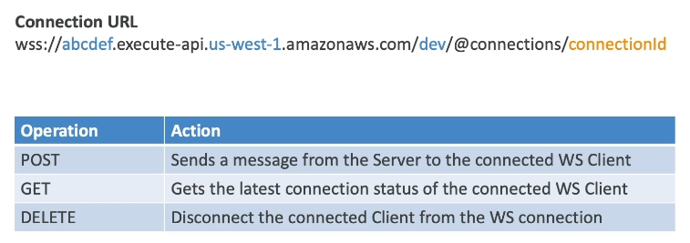
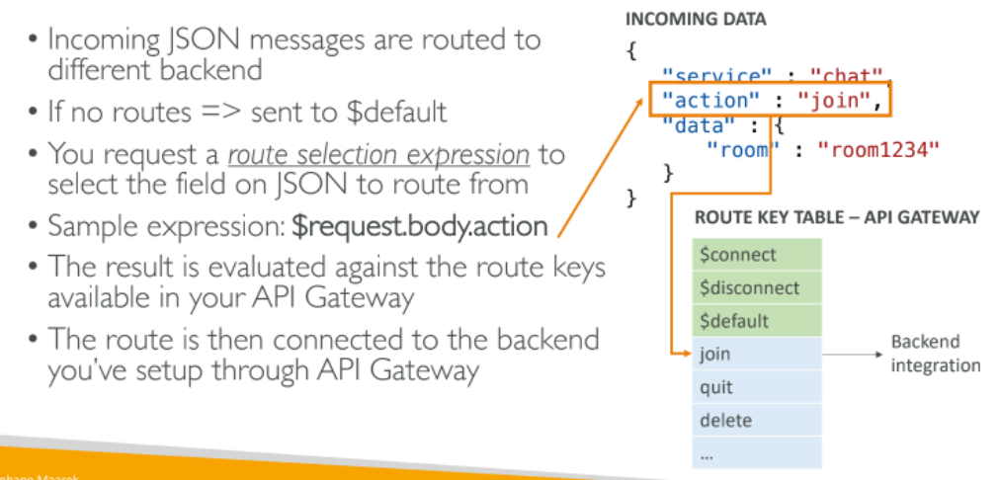
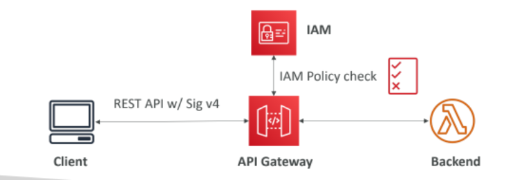
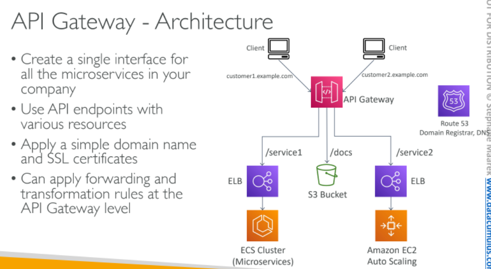
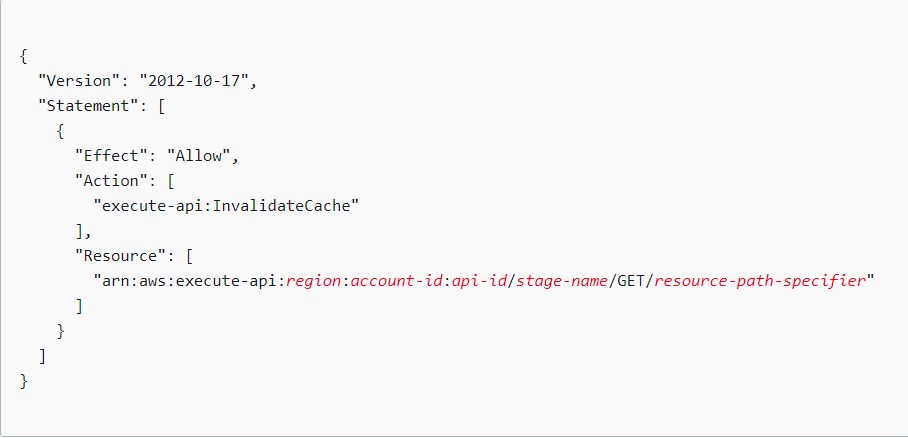

# API Gateway

- Amazon API Gateway is an AWS service for creating, publishing, maintaining, monitoring, and securing **REST, HTTP, and WebSocket APIs** at any scale.
- API Gateway acts as a "front door" for applications to access data, business logic, or functionality from your backend services, such as workloads running on Amazon Elastic Compute Cloud (Amazon EC2), code running on AWS Lambda, any web application, or real-time communication applications.
- Build **serverless apis**
- Support for WebSockets
    - Backend servers can easily push data to connected users and devices, avoiding the need to implement complex polling mechanisms.
    - API Gateway maintains a persistent connection between clients and API Gateway itself. There is no persistent connection between API Gateway and backend integrations such as Lambda functions. **Backend services are invoked as needed, based on the content of messages received from clients**.
    - **Hooks** that respond to user connection lifecycle:
        - **onConnect** lambda function (connectionId is passed into context)
        - **onDisconnect** lambda function
    - **Server communicates with clients** through gateway your backend resources perform a **POST to a specific URL (one per connectionID)** so you can send messages to that specific client. If you wanted you could do a **GET to get info about client** or **DELETE to disconnect client**.
    
- Handle API versioning
- Handle different environments
- Handle Security
- Create API keys and manage throttling (ideal for priced apis)
- Transform and validate requests and responses
- Cache API responses
- Integrate with: Lambdas, HTTP endpoints to a backend (with additional features of rate limiting functionality, caching, user auth, API key management, etc), any other AWS Service
- Endpoint types: Can be edge **optimized with help of CloudFront edge locations**, **APIGW actually is in one origin** though), can be **regional**, or **private** (only accessible within VPC using ENI)
- Types:
    - HTTP APIs: 
        - Enable you to create RESTful APIs with lower latency and lower cost than REST APIs. 
        - **Only support proxy integrations**
        - No usage plans and api keys
        - No data mapping features (but does have **"parameter mapping"** that is same concept but only with headers, query strings, or the request path, NOT body).
        - No request and response validations
        - **No WAF integration**
        - No Caching
        - Security: AWS Lambda, IAM, Cognito, **Native OpenID Connect / OAuth 2.0**
        - Integrations: Lambda, AWS services, Private ALB, Private NLB, PrivateCloudMap,**~~Mock~~**
    - REST APIS: 
        - **Proxy and Non Proxy integrations.**
        - Usage plans and api keys.
        - **Data mapping features.**
        - Security: AWS Lambda, IAM, Cognito, **~~Native OpenID Connect / OAuth 2.0~~**
        - Integrations: Lambda, AWS services, **~~Private ALB~~**, Private NLB, **~~PrivateCloudMap~~**, Mock
    - WebSockets
- Concepts:
    - **Deployment**: A **point-in-time snapshot** of your API Gateway API. To be available for clients to use, the **deployment must be associated with one or more API stages**.
    - Stage: A **logical reference to a lifecycle state of your API**(for example, 'dev', 'prod', 'beta', 'v2'). API stages are identified by API ID and stage name.
    - **Integration Request**: The internal interface of a WebSocket API route or REST API method in API Gateway, in which you **map** the body of a route request or the parameters and body of a method **request to the formats required by the backend**.
    - **Integration Response**: The internal interface of a WebSocket API route or REST API method in API Gateway, in which you **map** the status codes, headers, and **payload that are received from the backend to the response format that is returned to a client app**.
    - **Mock Request**: In a **mock integration**, API responses are generated from API Gateway directly, without the need for an integration backend.
    - **Proxy Integration**: API Gateway **passes the entire request and response between the frontend and an HTTP backend**. For Lambda proxy integration, API Gateway sends the entire request as input to a backend Lambda function. API Gateway then transforms the Lambda function output to a frontend HTTP response. But **no mapping templates are supported**
    - **Route**: A **WebSocket route in API Gateway is used to direct incoming messages to a specific integration**, such as an AWS Lambda function, based on the content of the message. When you define your WebSocket API, you specify a route key and an integration backend. The route key is an attribute in the message body. When the route key is matched in an incoming message, the integration backend is invoked. A **default route can also be set for non-matching route keys** or to specify a proxy model that passes the message through as-is to backend components that perform the routing and process the request.
    
- Develop the API:
    - You build a REST API as a collection of programmable entities known as API Gateway resources. **Each Resource entity can in turn have one or more Method resources**.
    - You then create an Integration resource to **integrate the Method with a backend endpoint**, also known as the integration endpoint, by forwarding the incoming request to a specified integration endpoint URI.
    - **If necessary, you transform request parameters or body to meet the backend requirements**. For responses, you can create a MethodResponse resource to represent a request response received by the client and you create an IntegrationResponse resource to represent the request response that is returned by the backend.
    - When setting up an API, you must choose a region. When deployed, the **API is region-specific**.
    - An API method embodies a **method request and a method response (what is expected)**. You set up an API method to define what a client should or must do to submit a request to access the service at the backend and to define the responses that the client receives in return. **An API method request is an HTTP request**.
    - As with the API method, the API integration has an integration request and an integration response. An **integration request encapsulates an HTTP request received by the backend**. It might or might not differ from the method request submitted by the client. An **integration response is an HTTP response encapsulating the output returned by the backend**.
        - Setting up an integration request involves the following: configuring how to pass client-submitted method requests to the backend; configuring how to transform the request data, if necessary, to the integration request data; and specifying which Lambda function to call, specifying which HTTP server to forward the incoming request to, or specifying the AWS service action to invoke.
        - Setting up an integration response (applicable to non-proxy integrations only) involves the following: configuring how to pass the backend-returned result to a method response of a given status code, configuring how to transform specified integration response parameters to preconfigured method response parameters, and configuring how to map the integration response body to the method response body according to the specified body-mapping templates.
    - API Gateway **can perform the basic validation**:
        - The required request parameters in the URI, query string, and headers of an incoming request are included and non-blank.
        - The applicable request payload adheres to the configured JSON schema request model of the method.
    - **Data transformations**: API's method request can take a payload in a different format from the corresponding integration request payload, as required in the backend. Similarly, the backend may return an integration response payload different from the method response payload, as expected by the frontend. API Gateway lets you use **mapping templates** to map the payload from a method request to the corresponding integration request and from an integration response to the corresponding method response. **(Eg: integrate with a SOAP api backend but clients connect through REST api. Mapping from JSON to XML will be needed)**.
    - If API Gateway fails to process an incoming request, it returns to the client an error response without forwarding the request to the integration backend. **By default, the error response contains a short descriptive error message**. For example, if you attempt to call an operation on an undefined API resource, you receive an error response with the { "message": "Missing Authentication Token" } message. If you are new to API Gateway, you may find it difficult to understand what actually went wrong. For some of the error responses, API Gateway allows customization by API developers to return the responses in different formats. Generalizing the API Gateway-generated error response to any responses generated by API Gateway, we refer to them as gateway responses. This distinguishes API Gateway-generated responses from the integration responses. **A gateway response mapping template can access $context variable values and $stageVariables property values, as well as method request parameters to generate custom gateway error messages.**
    - For support **CORS on non proxy**, a REST API resource needs to implement an **OPTIONS method** that can respond to the OPTIONS preflight request with at least the following response headers mandated by the Fetch standard:
        - Access-Control-Allow-Methods
        - Access-Control-Allow-Headers
        - Access-Control-Allow-Origin
    - The above is valid for APIs that are NOT proxy. If we need **CORS on proxy** we need **the integrated backend to include a response header "Access-Control-Origin:"\<domain\>""**
    - For a Lambda proxy integration or HTTP proxy integration, you can still set up the required OPTIONS response headers in API Gateway. However, your backend is responsible for returning the Access-Control-Allow-Origin and Access-Control-Allow-Headers headers, because a proxy integration doesn't return an integration response. Ej: 
    ```python
    import json

    def lambda_handler(event, context):
    return {
        'statusCode': 200,
        'headers': {
            'Access-Control-Allow-Headers': 'Content-Type',
            'Access-Control-Allow-Origin': 'https://www.example.com',
            'Access-Control-Allow-Methods': 'OPTIONS,POST,GET'
        },
        'body': json.dumps('Hello from Lambda!')
    }
    ```
- Deploying API:
    - To make an API callable, you must deploy your API to a stage.
    - You **create an API deployment and associate it with a stage.**
    -  A stage is a logical reference to a lifecycle state of your API (for example, dev, prod, beta, v2). API stages are identified by the API ID and stage name. They're included in the URL that you use to invoke the API.
    - As your API evolves, you can continue to deploy it to different stages as different versions of the API.
    - For each stage, you can **optimize API performance by adjusting the default account-level request throttling limits and enabling API caching**.
    - In addition, you can **override stage-level settings for individual methods** and define **stage variables** to pass stage-specific environment contexts to the API integration at runtime.
        - Stage variables are name-value pairs that you can define as configuration attributes associated with a deployment stage of a REST API. They act **like environment variables** and can be **used in your API setup and mapping templates**.
        - Using stage variables you can configure an API deployment stage to interact with different backend endpoints.
        - For example, your API can pass a GET request as an HTTP proxy to the backend web host (for example, http://example.com). In this case, the backend web host is configured in a stage variable so that when developers call your production endpoint, API Gateway calls example.com. When you call your beta endpoint, API Gateway uses the value configured in the stage variable for the beta stage, and calls a different web host (for example, beta.example.com). Similarly, stage variables can be used to specify a different AWS Lambda function name for each stage in your API.
        - For example, you can define a stage variable in a stage configuration, and then set its value as the URL string of an HTTP integration for a method in your REST API. Later, you can reference the URL string using the associated stage variable name from the API setup. This way, you can use the same API setup with a different endpoint at each stage by resetting the stage variable value to the corresponding URLs. You can also access stage variables in the mapping templates, or pass configuration parameters to your AWS Lambda or HTTP backend.
        - With deployment stages in API Gateway, you can manage multiple release stages for each API, such as alpha, beta, and production. Using stage variables you can configure an API deployment stage to interact with different backend endpoints. For example, your API can pass a GET request as an HTTP proxy to the backend web host (for example, http://tutorialsdojo.com). In this case, the backend web host is configured in a stage variable so that when developers call your production endpoint, API Gateway calls example.com. When you call your beta endpoint, API Gateway uses the value configured in the stage variable for the beta stage, and calls a different web host (for example, beta.tutorialsdojo.com). Similarly, stage variables can be used to specify a different AWS Lambda function name for each stage in your API.
        - You can also use stage variables to pass configuration parameters to a Lambda function through your mapping templates. For example, you might want to reuse the same Lambda function for multiple stages in your API, but the function should read data from a different Amazon DynamoDB table depending on which stage is being called. In the mapping templates that generate the request for the Lambda function, you can use stage variables to pass the table name to Lambda (this can be performed since **stage variables can be passed in the "context" object passed to lambda functions**).
        - **To declare stage variables using the API Gateway console**
        - A stage variable can be **used in a parameter mapping expression** for an API method's request or response header parameter.
        - A stage variable can be **used as part of an HTTP integration URL**
        - A stage variable can be **used as part of AWS URI action or path components**
        - A stage variable can be **used in place of a Lambda function name, or version/alias**
        - A stage variable can be **used as part of AWS user/role credential ARN**
        - Use Case: With deployment stages in API Gateway, you can manage multiple release stages for each API, such as alpha, beta, and production. Using stage variables you can configure an API deployment stage to interact with different backend endpoints.  your API can pass a GET request as an HTTP proxy to the backend web host (for example, http://example.com). In this case, the backend web host is configured in a stage variable so that when developers call your production endpoint, API Gateway calls example.com. When you call your beta endpoint, API Gateway uses the value configured in the stage variable for the beta stage, and calls a different web host (for example, beta.example.com). Similarly, stage variables can be used to specify a different AWS Lambda function name for each stage in your API. To use a stage variable to customize the HTTP integration endpoint, you must first configure a stage variable of a specified name (for example, url), and then assign it a value, (for example, example.com). Next, from your method configuration, set up an HTTP proxy integration. Instead of entering the endpoint's URL, you can tell API Gateway to use the stage variable value, http://${stageVariables.url}. This value tells API Gateway to substitute your stage variable ${} at runtime, depending on which stage your API is running.
    - A stage is a named reference to a deployment, which is a snapshot of the API.
    - Combining stages with Lambda Aliases
    
    - Canary Deployments: Way to send small amount of traffic to new version of API. Its specified at the stage level. If all goes well you promote the canary to receive all traffic.
- **API definition as code**: OpenAPI and Swagger integration. You can automatically create SDKS and export/import api templates.
- **Caching**:
    - Default TTP is **300s (5min) and max 1hr (3600s)**
    - Defines **per stage and can even be defined by method**
    - **Capacity: 0.5GB yo 237GB**
    - TTL=0 means caching is disabled.
    - Very expensive, justified for prod env.
    - **Clients can invalidate cache** if they have proper IAM authorization. Other way (which also needs authorization is to **send request with `Cache-Control: max-age = 0` header**).
    - A client of your API can invalidate an existing cache entry and reload it from the integration endpoint for individual requests. The client must send a request that contains the Cache-Control: max-age=0 header. The client receives the response directly from the integration endpoint instead of the cache, provided that the client is authorized to do so. This replaces the existing cache entry with the new response, which is fetched from the integration endpoint.
    - To grant permission for a client, attach a policy of the following format to an IAM execution role for the user:
    ```json
    {
        "Version": "2012-10-17",
        "Statement": [
            {
            "Effect": "Allow",
            "Action": [
                "execute-api:InvalidateCache"
            ],
            "Resource": [
                "arn:aws:execute-api:region:account-id:api-id/stage-name/GET/resource-path-specifier"
            ]
            }
        ]
    }    
    ```
- API Keys and Usage Plans: 
    - Control access
    - Use keys to identify clients and meter access
    - Configure **limits and throttling** on individual clients
    - **Callers of the API must supply an assigned API key in the x-api-key header** in requests to the API.
    - Steps:
        - Create APIs and deploy them to stages
        - Generate API keys to allow clients to access api
        - Create usage plans (throttling and limits)
        - **Associate API stages and keys with usage plans.**
- **CW Metrics to know**:
    - *CacheHitCount*
    - CacheMissCount:
    - Count: total number API requests in a given period.
    - IntegrationLatency: The time between when API Gateway relays a request to the backend and when it receives a response from the backend.
    - Latency: The time between when API Gateway receives a request from a client and when it returns a response to the client. The latency includes the integration latency and other API Gateway overhead.
    - 4XXError (client-side) & 5XXError (server-side)
- **Per account all gateways get total of 10.000 requests per second (soft limit)**. This can lead to throttling. Make use of usage plans, etc.
- Gateway **timeout is 29 seconds max** (if it does not receive response from backend then 504 error).
- Error messages:
    - Client
        - 400: Bad Request
        - 401: UnAuthorized
        - 403: Access Denied, WAF filtered
        - **429: Quota exceeded, Throttle**
    - Server:
        - 502: Bad Gateway Exception, usually for an incompatible output returned from a Lambda proxy integration backend and occasionally for out-of-order invocations due to heavy loads.
        - 503: Service Unavailable Exception
        - **504: Integration Failure** – ex Endpoint Request Timed-out
- Security:
    - **IAM + IAM policy**:
        - IAM credentials are included in headers and define access
        - **Good for users within your AWS account or cross accounts** access (with resource policies)
        
    - **Cognito User Pools**
        - Cognito manages user lifecycle and token expiration
        - Users get **tokens** from cognito and sends requests with that token
        - APIGW evaluates tokens
        - Allow access to backend
        
        - To use an Amazon Cognito user pool with your API, you must first create an authorizer of the **COGNITO_USER_POOLS** type and then configure an API method to use that authorizer. After the API is deployed, the client must first sign the user into the user pool, obtain an identity or access token for the user, and then call the API method with one of the tokens, which are typically set to the request's Authorization header. The API call succeeds only if the required token is supplied and the supplied token is valid, otherwise, the client isn't authorized to make the call because the client did not have credentials that could be authorized.
    - **Lambda Authorizer**
        - Most **customizable option**
        - JWT or request parameter-based (receives the caller's identity in a combination of headers, query string parameters, stageVariables, and $context variables)
        - Users get tokens from 3rd party service and perform queries with token
        - Gateway integrates with a custom lambda function (Lambda Authorizer) **which verifies token and returns IAM principal and IAM policy for the user which will be cached in Policy Cache**
        
        - There are two types of Lambda authorizers:
             - A **token-based Lambda authorizer** (also called a TOKEN authorizer) **receives the caller's identity in a bearer token**, such as a JSON Web Token (JWT) or an OAuth token.
                - For a Lambda authorizer (formerly known as a custom authorizer) of the TOKEN type, you must specify a custom header as the Token Source when you configure the authorizer for your API. The API client must pass the required authorization token in that header in the incoming request. Upon receiving the incoming method request, API Gateway extracts the token from the custom header. It then passes the token as the authorizationToken property of the event object of the Lambda function, in addition to the method ARN as the methodArn property:
                ```json
                {
                    "type":"TOKEN",
                    "authorizationToken":"{caller-supplied-token}",
                    "methodArn":"arn:aws:execute-api:{regionId}:{accountId}:{apiId}/{stage}/{httpVerb}/[{resource}/[{child-resources}]]"
                }
                ```
            - A **request parameter-based Lambda authorizer** (also called a REQUEST authorizer) receives the caller's identity in a **combination of headers, query string parameters, stageVariables, and $context variables.** For WebSocket APIs, only request parameter-based authorizers are supported.
                - For a Lambda authorizer of the REQUEST type, API Gateway passes request parameters to the authorizer Lambda function as part of the event object. The request parameters include headers, path parameters, query string parameters, stage variables, and some of request context variables. The API caller can set the path parameters, headers, and query string parameters. The API developer must set the stage variables during the API deployment and API Gateway provides the request context at run time.
                ```json
                {
                "type": "REQUEST",
                "methodArn": "arn:aws:execute-api:us-east-1:123456789012:abcdef123/test/GET/request",
                "resource": "/request",
                "path": "/request",
                "httpMethod": "GET",
                "headers": {
                    "X-AMZ-Date": "20170718T062915Z",
                    "Accept": "*/*",
                    "HeaderAuth1": "headerValue1",
                    "CloudFront-Viewer-Country": "US",
                    "CloudFront-Forwarded-Proto": "https",
                    "CloudFront-Is-Tablet-Viewer": "false",
                    "CloudFront-Is-Mobile-Viewer": "false",
                    "User-Agent": "..."
                },
                "queryStringParameters": {
                    "QueryString1": "queryValue1"
                },
                "pathParameters": {},
                "stageVariables": {
                    "StageVar1": "stageValue1"
                },
                "requestContext": {
                    "path": "/request",
                    "accountId": "123456789012",
                    "resourceId": "05c7jb",
                    "stage": "test",
                    "requestId": "...",
                    "identity": {
                    "apiKey": "...",
                    "sourceIp": "...",
                    "clientCert": {
                        "clientCertPem": "CERT_CONTENT",
                        "subjectDN": "www.example.com",
                        "issuerDN": "Example issuer",
                        "serialNumber": "a1:a1:a1:a1:a1:a1:a1:a1:a1:a1:a1:a1:a1:a1:a1:a1",
                        "validity": {
                        "notBefore": "May 28 12:30:02 2019 GMT",
                        "notAfter": "Aug  5 09:36:04 2021 GMT"
                        }
                    }
                    },
                    "resourcePath": "/request",
                    "httpMethod": "GET",
                    "apiId": "abcdef123"
                }
                }
                ```
            - **Cross-Account Lambda Authorizer**: Enables you to use an AWS Lambda function from a different AWS account as your API authorizer function. ( note that this is not a valid Lambda authorizer type).
        - Outputs form a lambda authorizer: A Lambda authorizer function's output is a dictionary-like object, which must include the principal identifier (principalId) and a policy document (policyDocument) containing a list of policy statements. The output can also include a context map containing key-value pairs. If the API uses a usage plan (the apiKeySource is set to AUTHORIZER), the Lambda authorizer function must return one of the usage plan's API keys as the usageIdentifierKey property value.
        ```json
        {
            "principalId": "yyyyyyyy", // The principal user identification associated with the token sent by the client.
            "policyDocument": {
                "Version": "2012-10-17",
                "Statement": [
                {
                    "Action": "execute-api:Invoke",
                    "Effect": "Allow|Deny",
                    "Resource": "arn:aws:execute-api:{regionId}:{accountId}:{apiId}/{stage}/{httpVerb}/[{resource}/[{child-resources}]]"
                }
                ]
            },
            "context": {
                "stringKey": "value",
                "numberKey": "1",
                "booleanKey": "true"
            },
            "usageIdentifierKey": "{api-key}"
        }
        ``` 



# Notes from practice tests
- **AWS WAF** is a **web application firewall** that lets you **monitor the HTTP(S) requests that are forwarded to an Amazon CloudFront distribution, an Amazon API Gateway REST API, an Application Load Balancer, or an AWS AppSync GraphQL API**. Tools to achieve this:
    - **Web ACLs** – You use a web access control list (ACL) to protect a set of AWS resources
    - **Rules**– Each rule contains a statement that defines the inspection criteria, and an action to take if a web request meets the criteria. When a web request meets the criteria, that's a match. You can configure rules to block matching requests, allow them through, count them, or run CAPTCHA controls against them.
    - **Rules groups** – You can use rules individually or in reusable rule groups. AWS Managed Rules and AWS Marketplace sellers provide managed rule groups for your use. You can also define your own rule groups.
- You can associate **each AWS resource with only one web ACL**. The **relationship between web ACL and AWS resources is one-to-many**.
- You can associate a web **ACL with one or more CloudFront distributions**. You **cannot associate a web ACL that you have associated with a CloudFront distribution with any other AWS resource type**.
- **AWS WAF calculates capacity differently** for each rule type, to reflect each rule's relative cost. **Simple rules that cost little** to run use fewer WCUs than more **complex rules that use more processing power cost more**. For example, a size constraint rule statement uses fewer WCUs than a statement that inspects against a regex pattern set.

- For API Gateway to pass the Lambda output as the API response to the client, the Lambda function must return the result in the following JSON format. If this format is not followed it will cause the **502 (Bad Gateway)** errors in the API Gateway.
```json
{
    "isBase64Encoded": true|false,
    "statusCode": httpStatusCode,
    "headers": { "headerName": "headerValue", ... },
    "body": "..." 
} 
```

- The following are the Gateway response types which are associated with the **HTTP 504** error in API Gateway:
    - **INTEGRATION_FAILURE** - The gateway response for an **integration failed error**. If the response type is unspecified, this response defaults to the DEFAULT_5XX type.
    - **INTEGRATION_TIMEOUT** - The gateway response for an **integration timed out error**. If the response type is unspecified, this response defaults to the DEFAULT_5XX type. The range is from **50 milliseconds to 29 seconds for all integration types**, including Lambda, Lambda proxy, HTTP, HTTP proxy, and AWS integrations.

- A large number of incoming requests will most likely produce an **HTTP 502 (Bad Gateway) or 429 (Too Many Requests)**

- The gateway response for **authorization failures** for missing authentication token error, invalid AWS signature error, or Amazon Cognito authentication problems is **HTTP 403 (Forbidden)**.

- A client of your API can **invalidate an existing cache** entry and reload it from the integration endpoint **for individual requests**. The client must send a request that contains the **Cache-Control: max-age=0 header**. The client receives the response directly from the integration endpoint instead of the cache, provided that the client is authorized to do so. This replaces the existing cache entry with the new response, which is fetched from the integration endpoint. **Ticking the Require authorization checkbox ensures that not every client can invalidate the API cache**. If most or all of the clients invalidate the API cache, this could significantly increase the latency of your API. To grant permission for a client, attach a policy of the following to an IAM execution role for the user.


- API Gateway supports the following endpoint ports: 80, 443 and 1024-65535.

- All of the APIs created with Amazon API Gateway expose HTTPS endpoints only. Amazon API Gateway does not support unencrypted (HTTP) endpoints. By default, Amazon API Gateway assigns an internal domain to the API that automatically uses the Amazon API Gateway certificate. When configuring your APIs to run under a custom domain name, you can provide your own certificate for the domain. If you try connecting through http you will get a **Connection Refused error**.

- Legacy SOAP service to modern REST:
    - You (or your organization) probably has some existing web services that respond to older protocols such as XML-RPC or SOAP. You can use the API Gateway to modernize these services.
    - In API Gateway, an API's method request can take a payload in a different format from the corresponding integration request payload, as required in the backend. Similarly, the backend may return an integration response payload different from the method response payload, as expected by the frontend. API Gateway lets you use mapping templates to map the payload from a method request to the corresponding integration request and from an integration response to the corresponding method response.
    