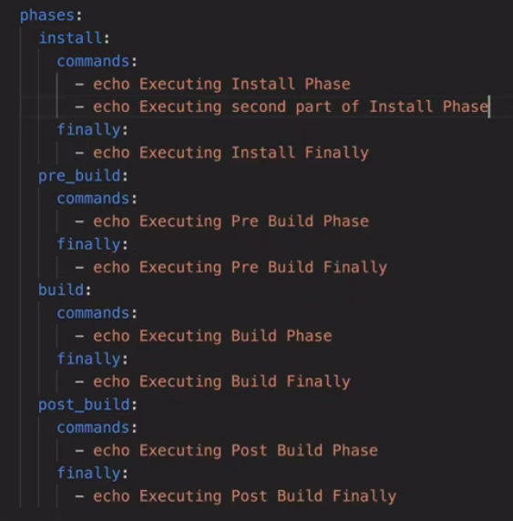
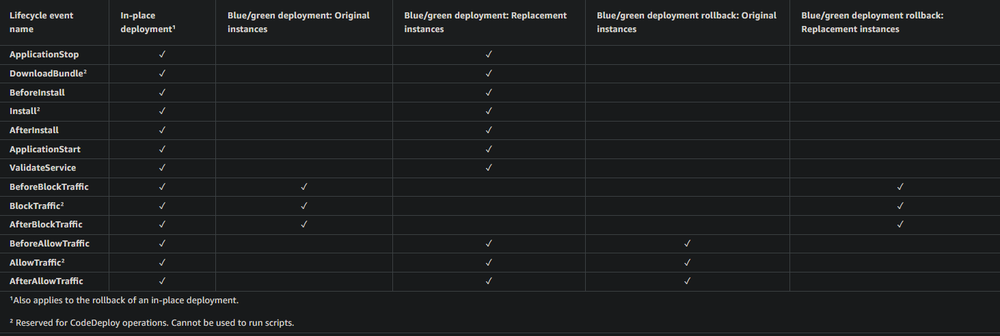
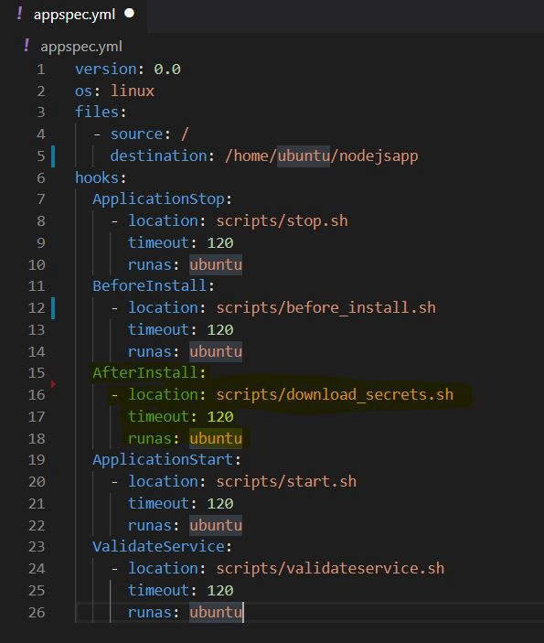
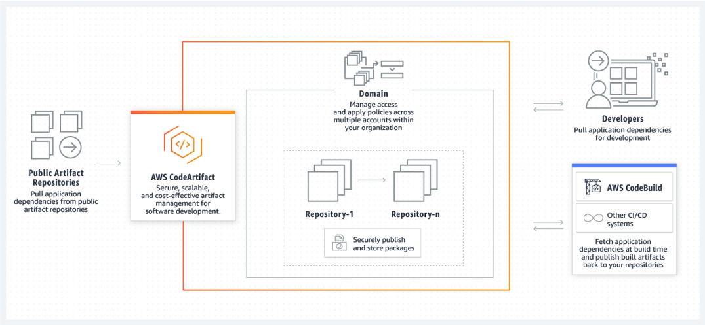

# CICD
- CI: Code -> Repo -> Build + Test (loop)
- CD: Deploy code that passed CI to an environment.
- For CD you can use EB or EC2 fleet with CodeDeploy
- The tool to orchestrate CCD is called CodePipeline.

## Code Commit
- If you want to give access to a **repo**, never share SSH keys or your own credentials. **Use IAM role in your AWS account and the other person need to use AWS STS (cross account access api call) to get credentials**. STS + IAM role.
- Cloud Commit notifications: **Notification to SNS or CloudWatch or lambda based on a certain action** regarding your code. A notification is **different than a trigger**. The later is more specific on actual code events like pushes, branches, etc.
- Security to CodeCommit is configured in your keys in your IAM console.
- Accessing Repositories
    - **IAM username and password credentials cannot be used to access CodeCommit**
    -  CodeCommit repositories are Git-based and support the basic functionalities of Git such as Git credentials. AWS recommends that you use an IAM user when working with CodeCommit. You can access CodeCommit with other identity types, but the other identity types are subject to limitations. The simplest way to set up connections to AWS CodeCommit repositories is to **configure Git credentials for CodeCommit in the IAM console, and then use those credentials for HTTPS connections**. You can also use these same credentials with any third-party tool or individual development environment (IDE) that supports HTTPS authentication using a static user name and password.
    - You can generate Git credentials or associate SSH public keys with your IAM user, or you can install and configure git-remote-codecommit. These are the easiest ways to set up Git to work with your CodeCommit repositories.
    - **A user that has access to CodeCommit needs to be granted permissions with IAM (by root account) and then enter AWS console to retrieve git credentials for CodeCommit.**
- Authentication
    - You can authenticate with CodeCommit (HTTPS) in two ways:
        1. Set-up a Git credential helper using your access key credentials specified in your AWS credential profile.
        2. Generate HTTPS Git credentials for AWS CodeCommit. Specify the credentials in the Git Credential Manager.
    - The AWS CLI includes a Git credential helper that you can use with CodeCommit. The Git credential helper requires an AWS credential profile, which stores a copy of an IAM user's AWS access key ID and AWS secret access key (along with a default AWS Region name and default output format). The Git credential helper uses this information to automatically authenticate with CodeCommit so you don't need to enter this information every time you use Git to interact with CodeCommit.
    - If you intend to use HTTPS with the credential helper that is included in the AWS CLI instead of configuring Git credentials for CodeCommit, on the Configuring extra options page, make sure the Enable Git Credential Manager option is cleared. The Git Credential Manager is only compatible with CodeCommit if IAM users configure Git credentials.
    - In a scenario that requires a developer to authenticate with CodeCommit using his access key credentials, he should set up a Git credential helper.

## Code Pipeline
- Visual tool to perform CD
- Orchestrate the pipeline
- **Pipelines work with artifacts** (code and other files stored in S3 that help pipeline execute the complete pipeline from commit to deploy).** Each stage creates an artifact that the next step uses to continue with the pipeline.**
- State changes of pipeline are logged to CW (which in turn can create notifications)
- If pipeline fails because cant perform an action then IAM service rol is incorrect. Pipeline needs access to other AWS services, check that necessary permissions are there.
- To check for changes, codepipeline uses AWS CW events to automatically start pipeline when a change occurs.
- You can **add/remove stages to Pipeline**. **Each stage is formed out of "action groups"**. **Each action group can be formed out of multiple actions** (an action is a task to be performed on an artifact) that can run in sequence or in parallel.
- Go to Pipeline > History for full info on stages/status/times.
- **Stages have multiple action groups that have multiple actions.**
- You can configure an approval action to **publish a message to an Amazon Simple Notification Service topic** when the pipeline stops at the action. Amazon SNS delivers the message to every endpoint subscribed to the topic. You must use a topic created in the same AWS region as the pipeline that will include the approval action. 

## Code Build
- Build + test
- Unlike Jenkins (which works with build agents), CodeBuild scales so there is **no build queues**. In Jenkins, if an agent is busy, then a queue is created on build operations.
- **Pay per Build**
- To test app on different envs, CodeBuild leverages docker. It gets your code, **creates a container and tests your code in it**. You can create your own **custom docker env** and provide it to CodeBuild (fully extensible).
- Build instructions are specified in **buildspec.yaml** file (that needs to be at root of project). You can define this directly form CodeBuild or di it through CodePipeline.
- **To speed up builds you can set an S3 cache with known dependencies**. If not, your builds will have to download and install them on each build.
- Phases in buildspec.yaml:   
    - Install
    - PreBuild
    - Build
    - PostBuild



- For deep troubleshooting, know that **you can run CodeBuild locally on your desktop.**
- CodeBuild can run multiple remote repository services.
- Once CodeBuild project is created you can integrate those projects to a pipeline.
- CodeBuild and VPC: **CB containers (for build and test) are launched outside your VPC so it cannot access other resources (like a test DB)** from your VPC. You can **change this by providing VPC information** when creating your Build Project so that build is ran inside your VPC. **You could also provide VPC endpoints** for security between codebuild and resources in VPC.
- A build represents a set of actions performed by AWS CodeBuild to create output artifacts (for example, a JAR file) based on a set of input artifacts (for example, a collection of Java class files).
- The following rules apply when you run multiple builds:   
    - When possible, **builds run concurrently. The maximum number of concurrently running builds can vary.**
    - Builds are queued if the number of concurrently running builds reaches its limit. **The maximum number of builds in a queue is five times the concurrent build limit.**
    - A **build in a queue that does not start after the number of minutes specified in its time out value is removed from the queue**. The default **timeout value is eight hours**. You can override the build queue timeout with a value between five minutes and eight hours when you run your build.
    - By setting the timeout configuration, the build process will automatically terminate post the expiry of the configured timeout.
- Security
    - Don't store secrets in plain text!
    - **Use Env variables that reference parameter store or secrets manager**
- You can use AWS CodeBuild with a proxy server to regulate HTTP and HTTPS traffic to and from the Internet. To run CodeBuild with a proxy server, you install a proxy server in a public subnet and CodeBuild in a private subnet in a VPC.
- Below are possible causes of error when running CodeBuild with a proxy server:
    - ssl-bump is not configured properly.
    - Your organization's security policy does not allow you to use ssl-bump.
    - Your buildspec.yml file does not have proxy settings specified using a proxy element.
    - If you do not use ssl-bump for an explicit proxy server, add a proxy configuration to your buildspec.yml using a proxy element.
    ```yaml
    version: 0.2
    proxy:
    upload-artifacts: yes
    logs: yes
    ```
- Full buildspec.yaml syntax
```yaml
version: 0.2

run-as: Linux-user-name

env:
  shell: shell-tag
  variables:
    key: "value"
    key: "value"
  parameter-store:
    key: "value"
    key: "value"
  exported-variables:
    - variable
    - variable
  secrets-manager:
    key: secret-id:json-key:version-stage:version-id
  git-credential-helper: no | yes

proxy:
  upload-artifacts: no | yes
  logs: no | yes

batch:
  fast-fail: false | true
  # build-list:
  # build-matrix:
  # build-graph:
        
phases:
  install:
    run-as: Linux-user-name
    on-failure: ABORT | CONTINUE
    runtime-versions:
      runtime: version
      runtime: version
    commands:
      - command
      - command
    finally:
      - command
      - command
  pre_build:
    run-as: Linux-user-name
    on-failure: ABORT | CONTINUE
    commands:
      - command
      - command
    finally:
      - command
      - command
  build:
    run-as: Linux-user-name
    on-failure: ABORT | CONTINUE
    commands:
      - command
      - command
    finally:
      - command
      - command
  post_build:
    run-as: Linux-user-name
    on-failure: ABORT | CONTINUE
    commands:
      - command
      - command
    finally:
      - command
      - command
reports:
  report-group-name-or-arn:
    files:
      - location
      - location
    base-directory: location
    discard-paths: no | yes
    file-format: report-format
artifacts:
  files:
    - location
    - location
  name: artifact-name
  discard-paths: no | yes
  base-directory: location
  exclude-paths: excluded paths
  enable-symlinks: no | yes
  s3-prefix: prefix
  secondary-artifacts:
    artifactIdentifier:
      files:
        - location
        - location
      name: secondary-artifact-name
      discard-paths: no | yes
      base-directory: location
    artifactIdentifier:
      files:
        - location
        - location
      discard-paths: no | yes
      base-directory: location
cache:
  paths:
    - path
    - path

```

## Code Deploy
- Deploy to many EC2 instances (without beanstalk)
- **CodeDeploy agents need to be installed on EC2 instances**. They poll for new code.
- CodeDeploy sends **appspec.yaml** to EC2s (it defines how app is going to be deployed). It also tells how to source code from S3. EC2s run the instructions specified in appspec.yaml.
- Agents will notify CodeDeploy upon success or failure of deployment.
- The CodeDeploy agent is a software package that, when installed and configured on an instance, makes it possible for that instance to be used in CodeDeploy deployments. **The CodeDeploy agent communicates outbound using HTTPS over port 443**.
- The CodeDeploy agent is a software package that, when installed and configured on an instance, makes it possible for that instance to be used in CodeDeploy deployments. **The CodeDeploy agent archives revisions and log files on instances. The CodeDeploy agent cleans up these artifacts to conserve disk space. You can use the :max_revisions: option in the agent configuration file to specify the number of application revisions to the archive by entering any positive integer.** CodeDeploy also archives the log files for those revisions. All others are deleted, except for the log file of the last successful deployment.
- **Components**:
    - **Application** (with appspec.yaml at root)
    - **Compute platform** (EC2, On-premise, Lambda, ECS)
        - Amazon **EC2/On-premise** instances
        - Serverless **Lambda** functions
        - Amazon **ECS** services.
    - **Deployment Config**: Set of deployment rules and deployment success and failure conditions used by CodeDeploy during a deployment. If your deployment uses the EC2/On-Premises compute platform, you can specify the minimum number of healthy instances for the deployment. If your deployment uses the AWS Lambda or the Amazon ECS compute platform, you can specify how traffic is routed to your updated Lambda function or ECS task set.
        - Types: 
            - Canary: Traffic is shifted in two increments.
            - Linear: Traffic is shifted in equal increments with an equal number of minutes between each increment
            - All-at-once: All traffic is shifted from the original Lambda function or ECS task set to the updated function or task set all at once.
        - Deployments that use the **EC2/On-Premises** compute platform manage the way in which traffic is directed to instances by using an **in-place or blue/green** deployment type.
        - You can manage the way in which traffic is shifted to the updated **Lambda** function versions during a deployment by choosing a **canary**, **linear**, or **all-at-once** configuration.
        - For **ECS** you can manage the way in which traffic is shifted to the updated task set during a deployment by choosing a **canary**, **linear**, or **all-at-once** configuration.
    - **Deployment group**: Grouped compute resources to gradually deploy to specific targets (identified with Tags)
    - [Deployment Types](https://docs.aws.amazon.com/codedeploy/latest/userguide/primary-components.html#primary-components-deployment-type): method used to make the latest application revision available on instances in a deployment group. There are two deployment types:
        - **In place**: Only deployments that use the EC2/On-Premises compute platform can use in-place deployments.
            - One at a time
            - Half at a time
            - All at once
            - Custom (like maintain a minimum number healthy instances)
        - **Blue Green**:
            - Blue/green deployments only work with Amazon EC2 instances only, **NOT for On-premise**.
            - For **EC2**: New ASG with new version, once its stable, the ELB redirects to the new ASG. We can chose how long to keep old ASG.
            - Blue/green on an **AWS Lambda or Amazon ECS** compute platform: Traffic is shifted in increments accorinding to a canary, linear, or all-at-once deployment configuration. All AWS Lambda compute platform deployments are blue/green deployments.
        - For Lambda and ECS, you can only do a blue/green deployment in CodeDeploy. This type of deployment is actually done in Elastic Beanstalk for Multicontainer docker environment which implicitly uses ECS.
    - **IAM Instance Profile**: **Roles EC2s are going to run** to access other resources. MUST use an ELB.
    - **Service Role**: **Role CodeDeploy needs** to perform actions
    - **Target Revisions**: The **most recent version you want to deploy** to a Deployment Group.
- **Hooks** also exist to tell EC2s to execute additional instructions to deploy new version.
- An EC2/On-Premises deployment hook is executed once per deployment to an instance. You can specify one or more scripts to run in a hook. Each hook for a lifecycle event is specified with a string on a separate line. Here are descriptions of the hooks available for use in your AppSpec file.
    - AppSpec 'hooks' section for an Amazon ECS deployment
    
    - AppSpec 'hooks' section for an AWS Lambda deployment
    
    - AppSpec 'hooks' section for an EC2/On-Premises deployment
    





- **DownloadBundle** deployment lifecycle event will **throw an error whenever**:
    - The EC2 instance’s IAM profile does not have **permission to access the application code in the Amazon S3**.
    - An **Amazon S3 internal error** occurs.
    - The instances you deploy to are associated with one AWS Region (for example, US West Oregon), but the Amazon S3 bucket that contains the application revision is related to another AWS Region (for example, US East N. Virginia). **Regions don't match between where app is deployed and code is stored in S3**
- **ValidateService**: Its important to include this step since it where we can **run commands to see if our service is running as expected before notifying CodeDeploy that everything is OK**.
- CodeDeploy is something thats more powerful than EB. EB forces you to use a set of apps/platforms, while CD can be anything you want but with added complexity.
- CodeDeploy does NOT provision resources. They have to be available.
- To rollback, redeploy old deployment or enable automated rollback for failures. **It rollback occurs, CD redeploys last known good revision as a new deployment.** This means that a new app version will be created which will be this last known good deployment. **AWS CodeDeploy rolls back deployments by redeploying a previously deployed revision of an application as a new deployment on the failed instances.**
    - Eg: An e-commerce company has implemented AWS CodeDeploy as part of its AWS cloud CI/CD strategy. The company has configured automatic rollbacks while deploying a new version of its flagship application to Amazon EC2. What occurs if the deployment of the new version fails?
        - A new deployment of the last known working version of the application is deployed with a new deployment ID -> YES
        - The last known working deployment is automatically restored using the snapshot stored in Amazon S3 
        - AWS CodePipeline promotes the most recent working deployment with a SUCCEEDED status to production
        - CodeDeploy switches the Route 53 alias records back to the known good green deployment and terminates the failed blue deployment 

## CodeStar
- **Integrated Solution for above services**
- Limited customization but gets you up and running fast and in one place
- Every underlying resource is created for you. If you delete the codestar project, all underlying resources are deleted.

## Code Artifact
- Artifact Management: How to **manage the storing and retrieval of dependencies** necessary for your app.
- By using this service, **both developers and CodeBuild can retrieve the dependencies directly form CodeArtifact**.
- Your create a Domain inside CodeARtifact which containers multiple package repositories. 
- Your devs instead of reaching out to public library/package management systems you get it from CA.



## CodeGuru
- **ML powered service for code review**
- **CodeGuru Reviewer** does automatic code reviews for **static code** analysis
- **CodeGuru Profiler** gives visibility/recommendations about app performance **during runtime** (production). Minimal overhead on app for running profiler.

# Quiz
- Your CodeBuild has failed. What ist a solution to troubleshoot what happened?
    - Look for logs iun CW logs
    - Look through logs in S3
    - SSH into CodebuildContainer and debug from there. -> THIS IS NOT A SOLUTION. **Containers are deleted at then end of the execution. You cant ssh into them.**
    - Run Codebuild locally

- You would like to deploy a static website in S3 automatically, after generating the static website from markdown files. Which service should you use for this?
    - CodePipeline + CodeBuild: CodeBuild can run any commands, so you can use it to run commands including generating static website and copying them into S3. No need for deployment tool.
