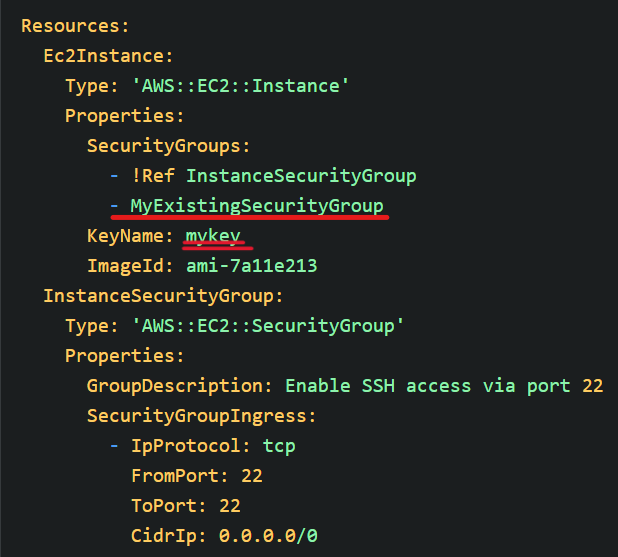
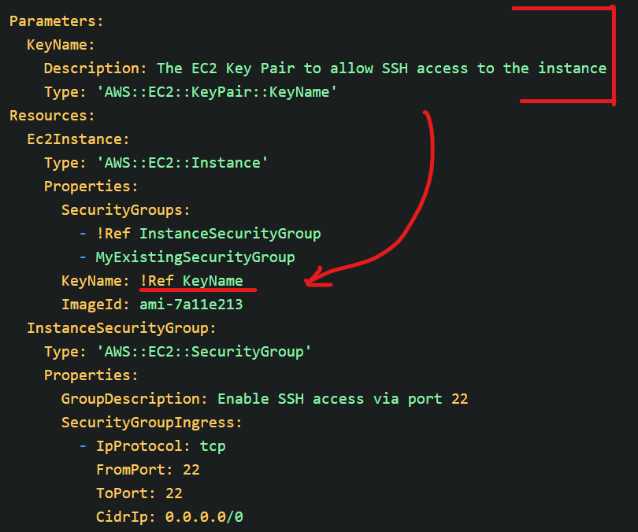
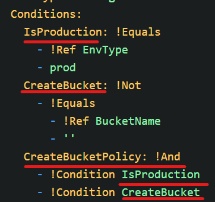
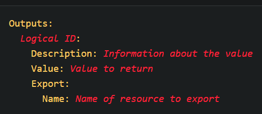

# CloudFormation

- Infrastructure as Code
- Can be versioned controlled just as code versioning can.
- Automatic generation of diagrams directly form code!
- **A template creates a stack. You create/update/delete stacks through templates**
- [Template Anatomy](https://docs.aws.amazon.com/AWSCloudFormation/latest/UserGuide/template-anatomy.html):
    - Format Version (optional)
    - Description (optional)
    - Metadata (optional): Additional data about template
    - **Resources**: 
        - **Core part of CF template**
        - Its a **mandatory component** for any template
        - 224 types of resources (see [link](https://docs.aws.amazon.com/AWSCloudFormation/latest/UserGuide/aws-template-resource-type-ref.html) for full list).
        - The name used for a resource within the template is a logical name. When CloudFormation creates the resource, it generates a physical name that's based on the combination of the logical name, the stack name, and a unique ID.
        - Resources have properties:
            - A property for a resource is simply a string value.
            - **Some resources can have multiple properties, and some properties can have one or more subproperties**.
            
        - Refer to other resources and their properties with `!Ref`.
        
        - Refer to existing resources (bot, sg and key, need to exist or else running template ends in failure)
        
    - **Template Helpers: Parameters**
        - Provide inputs to CF templates to add a bit of customization and reusability
        - **Parameters have a type, a description and can include constraints together with default values and expected values for the parameter**.
        - The **Ref function can refer to input parameters** that are specified at stack creation time. The following template adds a Parameters object containing the KeyName parameter, which is used to specify the KeyName property for the AWS::EC2::Instance resource. The parameter type is AWS::EC2::KeyPair::KeyName, which ensures a user specifies a valid key pair name in his or her account and in the region where the stack is being created.
        
        - **Pseudo parameters** are parameters that are **predefined by AWS** CloudFormation. You don't declare them in your template. Use them the same way as you would a parameter, as the argument for the Ref function. For full list of pseudo-parameters see following [link](https://docs.aws.amazon.com/AWSCloudFormation/latest/UserGuide/pseudo-parameter-reference.html)
            - **AWS::Region**
            - **AWS::AccountId**: Returns the AWS account ID of the account in which the stack is being created
            - **AWS::NotificationARNs**: Returns the list of notification Amazon Resource Names (ARNs) for the current stack.
            - **AWS::NoValue**: Removes the corresponding resource property when specified as a return value in the Fn::If intrinsic function (eg: set a resource property to a parameter if a condition holds or else completely remove that property)
            - **AWS::Partition**: Returns the partition that the resource is in. For standard AWS Regions, the partition is aws. For resources in other partitions, the partition is aws-partitionname. For example, the partition for resources in the China (Beijing and Ningxia) Region is aws-cn and the partition for resources in the AWS GovCloud (US-West) region is aws-us-gov.
            - **AWS::Region**: Returns a string representing the Region in which the encompassing resource is being created, such as us-west-2.
            - **AWS::StackId**: Returns the ID of the stack as specified with the aws cloudformation create-stack command.
            - **AWS::StackName**: Returns the name of the stack as specified with the aws cloudformation create-stack command, such as teststack.
            - **AWS::URLSuffix**: Returns the suffix for a domain. The suffix is typically amazonaws.com, but might differ by Region. For example, the suffix for the China (Beijing) Region is amazonaws.com.cn.
        - **You could reference SSM for specific secret keys**.
    - **Template Helpers: Intrinsic Functions**
        - **Fn::Base64**: Returns the Base64 representation of the input string. This function is typically used to pass encoded data to Amazon EC2 instances by way of the UserData property.
        - **Fn::Cidr**: Returns an array of CIDR address blocks. The number of CIDR blocks returned is dependent on the count parameter.
        - **Fn::FindInMap**: Returns the value corresponding to keys in a two-level map that's declared in the Mappings section.
        - **Fn::GetAtt**: **Returns the value of an attribute from a resource** in the template. Each resource type has certain properties that can be accessed in the template. This example snippet returns a string containing the DNS name of the load balancer with the logical name myELB 
        ```yaml
        "Fn::GetAtt" : [ "myELB" , "DNSName" ]
        ```
        - **Fn::GetAZs**:  Returns an array that lists Availability Zones for a specified region in alphabetical order. Because customers have access to different Availability Zones, the intrinsic function Fn::GetAZs enables template authors to write templates that adapt to the calling user's access. That way you don't have to hard-code a full list of Availability Zones for a specified region.
        - **Fn::ImportValue**: Returns the value of an output exported by another stack.
        - **Fn::Join**: Appends a set of values into a single value, separated by the specified delimiter
        - **Fn::Select**: Returns a **single object from a list** of objects by index
        - **Fn::Split**: Split a string into a list of string values so that you can select an element from the resulting string list
        - **Fn::Sub**: **Substitutes** variables in an input string with values that you specify.
        - **Fn::Transform**: Specifies a **macro to perform custom processing on part of a stack template**. Macros enable you to perform custom processing on templates, from simple actions like **find-and-replace operations to extensive transformations of entire templates**. The AWS::Serverless transform, which is a macro hosted by AWS CloudFormation, takes an entire template written in the AWS Serverless Application Model (AWS SAM) syntax and transforms and expands it into a compliant AWS CloudFormation template. **So, presence of "Transform" section indicates, the document is a SAM template.** When you specify a transform, you can use AWS SAM syntax to declare resources in your template. The model defines the syntax that you can use and how it is processed.
            - AWS CloudFormation also supports the **AWS::Serverless** and **AWS::Include** transforms, which are macros hosted by AWS CloudFormation. AWS CloudFormation treats these transforms the same as any macros you create in terms of execution order and scope.
        - **Ref**: Returns the value of the specified parameter or resource
    - **Conditions**:
        - Contains statements that define the **circumstances under which entities are created or configured.**
        - Conditions are evaluated based on predefined pseudo parameters or input parameter values that you specify when you create or update a stack. Within each condition, you can reference another condition, a parameter value, or a mapping. **After you define all your conditions, you can associate them with resources and resource properties** in the Resources and Outputs sections of a template.
        - You can include conditions in:
            - **Parameter Section**
            - **Conditions section** (you put a name to the condition and specify the logical condition, you then use that condition throughout the rest of the template)
            - **Resources section**
            - **Output section.**
        - You make use of conditions intrinsic functions:
            - Fn::And
            - Fn::Equals
            - Fn::If
            - Fn::Not
            - Fn::Or
        - You can **nest conditions**
        
    - **Mappings**
        - Fixed variables
        - Great when you know in advance all the values that can be taken
        - To get a value in mapping use:
            - **![Find Map[MapName, TopLevelKey, SecondLEvelKey]]**.
    - **Outputs**
        - Optional field
        - We **export values that can later be imported into other templates**
        - Allows you to start linking templates. Eg: You have a network CF that outputs VPC and subnet ids so that other templates can use them.
        - Use to get a good **separation of concerns** (network team and dev team create different templates)
        - You cant delete a CF stack if its outputs are being used by another CF stack.
        
        - **Export Output name must be unique within region!** If two outputs are named equally you will have an error.
- **Rollbacks: If CF stack creation fails it rollbacks to previous stack if enabled ("rollback on failure").**
- **Change Sets**: When we update a stack, you need to know what changes are to be performed before it happens for greater confidence. **Review changes before executing the change set and modifying infra**. 
- **Nested Stacks vs Cross Stacks**
    - **Cross Stacks is for separation of concerns** and permit experts of each area to do their best work. Different experts create different stacks. **Heavy use of Export outputs and Import values**
    - **Nested Stacks** allow you to **isolate different components**. Its not a shared component, you just reuse its creation. Isolate its creation and use it when needed for another stack.
- **Stack Set**
    - **Create/Update/Delete stacks across multiple accounts and regions with a single operation**. Using an administrator account, you define and manage an AWS CloudFormation template, and use the template as the basis for provisioning stacks into selected target accounts across specified AWS Regions.
    - After you've defined a stack set, you can create, update, or delete stacks in the target accounts and regions you specify. When you create, update, or delete stacks, you can also specify operational preferences, such as the order of regions in which you want the operation to be performed, the failure tolerance beyond which stack operations stop, and the number of accounts in which operations are performed on stacks concurrently. Remember that a stack set is a regional resource so if you create a stack set in one region, you cannot see it or change it in other regions (you manage it all from one region and impact in other regions/accounts).
- **Cloud Formation Drift**: 
    - **CF creates underlying infra**
    - Once created, each **component may be modified independently from the console** (in some cases not even by you).
    - With **CF drift we can se exactly how out infra drifted form the initial state deployed by template**.


## Notes from practice tests
- Before being used by Cloud Formation, your templates are uploaded
    - To CF -> NO! This is only true from the AWS console, and then by using this option, your template is uploaded to **AWS S3**. CF uses a reference to S3. 
    - To S3 -> YES! 

- CloudFormation currently supports the following **parameter types**:
    - **String** – A literal string
    - **Number** – An integer or float
    - **List\<Number\>** – An array of integers or floats
    - **CommaDelimitedList** – An array of literal strings that are separated by commas
    - **AWS::EC2::KeyPair::KeyName** – An Amazon EC2 key pair name
    - **AWS::EC2::SecurityGroup::Id** – A security group ID
    - **AWS::EC2::Subnet::Id** – A subnet ID
    - **AWS::EC2::VPC::Id** – A VPC ID
    - **List\<AWS::EC2::VPC::Id\>** – An array of VPC IDs
    - **List\<AWS::EC2::SecurityGroup::Id\>** – An array of security group IDs
    - **List\<AWS::EC2::Subnet::Id\>** – An array of subnet IDs

- Commands
    - **`package`**:
        - **Packages** the local artifacts (local paths) that your AWS CloudFormation template references. The command **uploads local artifacts**, such as source code for an AWS Lambda function or a Swagger file for an AWS API Gateway REST API, **to an S3 bucket**. The command returns a copy of your template, replacing references to local artifacts with the S3 location where the command uploaded the artifacts.
        - Use this command to quickly upload local artifacts that might be required by your template. After you package your template's artifacts, run the deploy command to deploy the returned template.
        - The command **uploads local artifacts**, such as source code for an AWS Lambda function or a Swagger file for an AWS API Gateway REST API, to an S3 bucket. The command **returns a copy of your template**, **replacing references to local artifacts with the S3 location where the command uploaded the artifacts.**
    - **`deploy`**:
        - **Deploys the specified AWS CloudFormation template by creating and then executing a change set**. The command terminates after AWS CloudFormation executes the change set. **If you want to view the change set before AWS CloudFormation executes it, use the --no-execute-changeset flag**.
    - `aws cloudformation validate-template`: Check the template if it is a valid JSON or YAML file.
    - `aws cloudformation update-stack`: Updates an existing stack.

- CF Helper scripts:
    - Python helper scripts that you can use to **install software and start services on an Amazon EC2 instance** that you create as part of your stack. Used in **UserData** part of EC2 CF template
    - Scripts:
        - **cfn-init**: Use to retrieve and interpret resource metadata, install packages, create files, and start services.
        - **cfn-signal**: Use to signal with a CreationPolicy or WaitCondition, so you can synchronize other resources in the stack when the prerequisite resource or application is ready.
        - **cfn-get-metadata**: Use to retrieve metadata for a resource or path to a specific key.
        - **cfn-hup**: Use to check for updates to metadata and execute custom hooks when changes are detected.