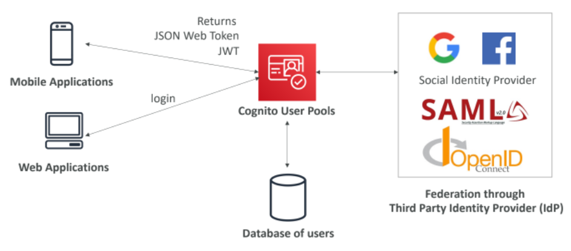
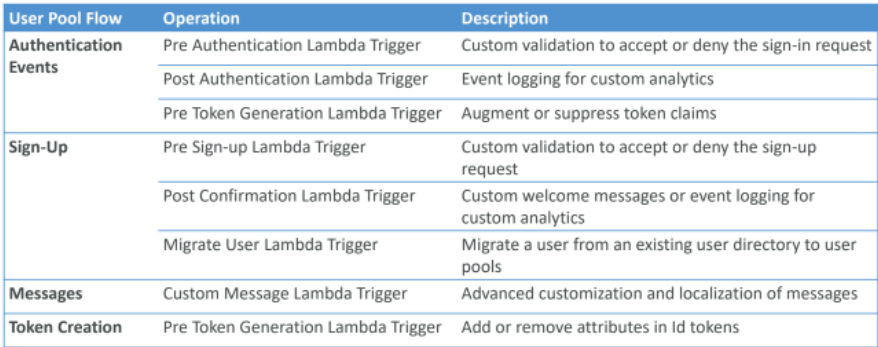
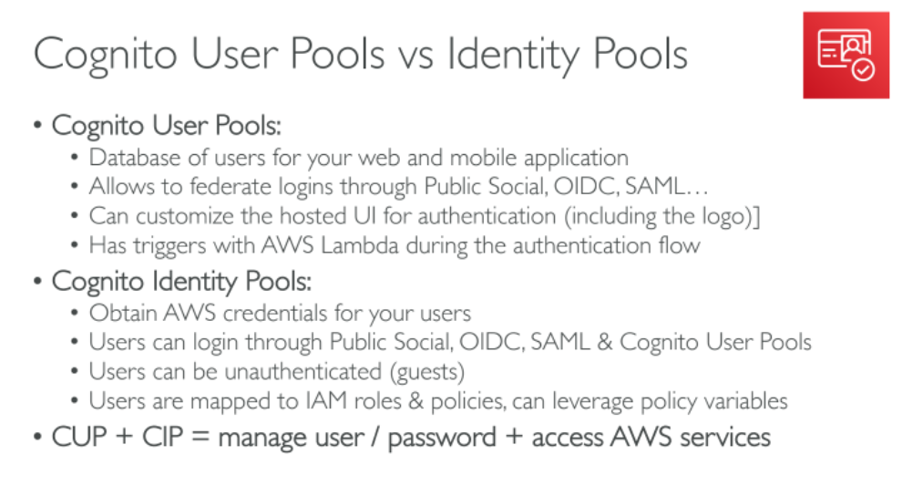
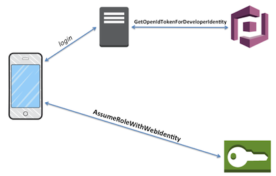

# Cognito

- Giving users an identity so they can interact with app
- **NOT IAM users but users outside of our cloud**
- **Cognito User Pools**
    - Sign in functionality for app users
    - Integrate with **API gateway and app load balancer natively (not CF!)**.
    - Serverless database of users for your webapp.
    - Once identified they are sent a JSON web token (**JWT**) so they can interact with services.
    - **Email & Phone Number Verification functionality**. **MFA**
    
    - You can **invoke lambda functions synchronously on different events** regarding user activity with cognito (sign in, passwords, recovery, etc)
    
    - You can **customize the cognito login page** which will then redirect to underlying resource or web page.
        - You can upload a custom logo image to be displayed in the app. You can also choose many CSS customizations.
        - You can specify app UI customization settings for a single client (with a specific clientId) or for all clients (by setting the clientId to ALL). If you specify ALL, the default configuration will be used for every client that has no UI customization set previously. If you specify UI customization settings for a particular client, it will no longer fall back to the ALL configuration.
        - You can include the product logo on the webpage by **uploading the logo in the Cognito app settings under UI customization**.
- **Cognito Identity Pools (Federate Identity)**
    - Provide AWS credentials to users so they can access AWS resources directly
    - Integrate with Cognito User Pools as an identity provider
    - **Give access to AWS resources by giving temporary credentials with STS.**
    
    - Once authenticated they can access AWS directly using SDK or through API gateway.
    - Integrate with third party identity providers (Federated Identities)
    - **Allow unauthenticated access** to AWS (guest users)
    - You define IAM policy for the credentials (defined directly through Cognito)
    
    - **Users login through third party or User Pool**. After that, they **communicate to Cognito Identity Pool and exchange token for temporary credentials (through STS)**. After that users can access resources.
    - **How does Identity Pool know which role to apply to which user?**
        - We can apply a **default role** for both authenticated and guest users
        - We can later choose which roles go to which users **based on users id**.
        - Use **user ids as policy variables** to dynamically allow access to resources specific to that user.
- **Cognito Sync (now replaced with AppSync)**
    - Synchronize data from device to Cognito
    - Save state of preferences, configuration, state of app of users
    - Cross device synchronization
    - Offline capability
    - Store data in datasets (up yp 1MB) up to 20 datasets to synchronize
    - Features:
        - Push Sync: silently notify across all devices when identity data changes
        - Cognito Stream: stream data from Cognito into Kinesis
        - Cognito Events: execute Lambda functions in response to events
    - Amazon Cognito Sync is an AWS service and client library that enables cross-device syncing of application-related user data. You can use it to synchronize user profile data across mobile devices and the web **without requiring your own backend**. The client libraries cache data locally so your app can read and write data regardless of device connectivity status. When the device is online, you can synchronize data, and if you set up push sync, notify other devices immediately that an update is available.
    - Amazon Cognito lets you save end user data in datasets containing key-value pairs. This data is associated with an Amazon Cognito identity, so that it can be accessed across logins and devices. To sync this data between the Amazon Cognito service and an end user’s devices, invoke the synchronize method. Each dataset can have a maximum size of 1 MB. You can associate up to 20 datasets with an identity.
    - The Amazon Cognito Sync client creates a local cache for the identity data. Your app talks to this local cache when it reads and writes keys. This guarantees that all of your changes made on the device are immediately available on the device, even when you are offline. When the synchronize method is called, changes from the service are pulled to the device, and any local changes are pushed to the service. At this point the changes are available to other devices to synchronize.
    - Amazon Cognito automatically tracks the association between identity and devices. Using the push synchronization, or push sync, feature, you can ensure that every instance of a given identity is notified when identity data changes. Push sync ensures that, whenever the sync store data changes for a particular identity, all devices associated with that identity receive a silent push notification informing them of the change.

- Amazon Cognito supports developer authenticated identities, in addition to web identity federation through Facebook (Identity Pools), Google (Identity Pools), Login with Amazon (Identity Pools), and Sign in with Apple (Identity Pools). With developer authenticated identities, you can register and authenticate users via your own existing authentication process, while still using Amazon Cognito to synchronize user data and access AWS resources. Using developer authenticated identities involves interaction between the end-user device, your backend for authentication, and Amazon Cognito. Developers can use their own authentication system with Cognito. What this means is that your app can benefit from all of the features of Amazon Cognito while utilizing your own authentication system. This works by your app requesting a unique identity ID for your end-users based on the identifier you use in your own authentication system. You can use the Cognito identity ID to save and synchronize user data across devices with the Cognito sync service or retrieve temporary, limited-privilege AWS credentials to securely access your AWS resources. The process is simple, you first request a token for your users by using the server-side Cognito API for **developer authenticated identities**. Cognito then creates a valid token for your users. You can then exchange this token with Amazon Secure Token Service for AWS credentials.

With developer authenticated identities, a new API, `GetOpenIdTokenForDeveloperIdentity`, was introduced. This API call replaces the use of GetId and GetOpenIdToken (APIs needed in the basic authflow) from the device and should be called from your backend as part of your own authentication API. Because this API call is signed by your AWS credentials, Cognito can trust that the user identifier supplied in the API call is valid. This r**eplaces the token validation Cognito performs with public providers**.
