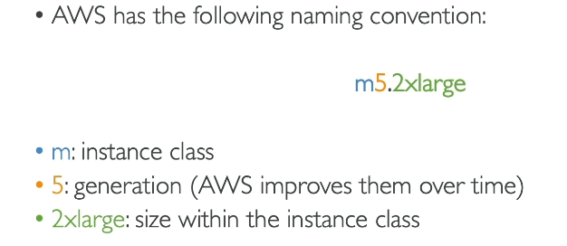
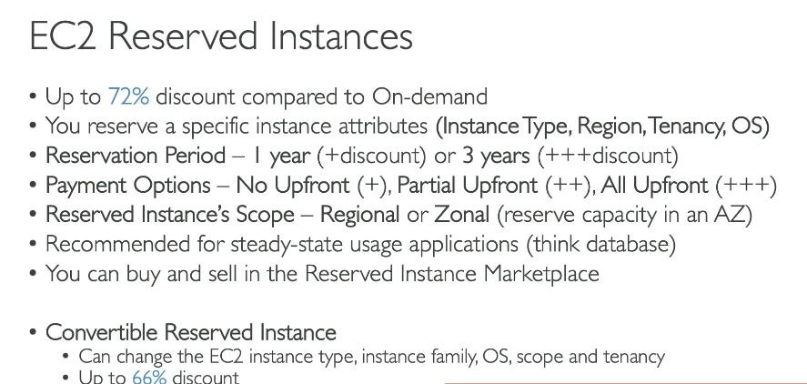
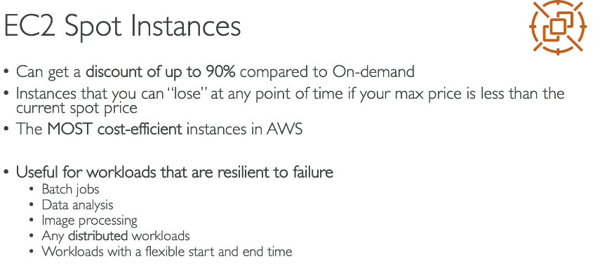
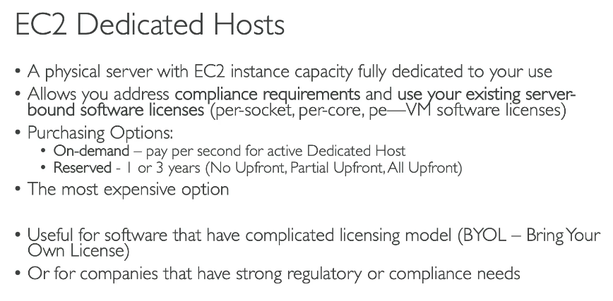
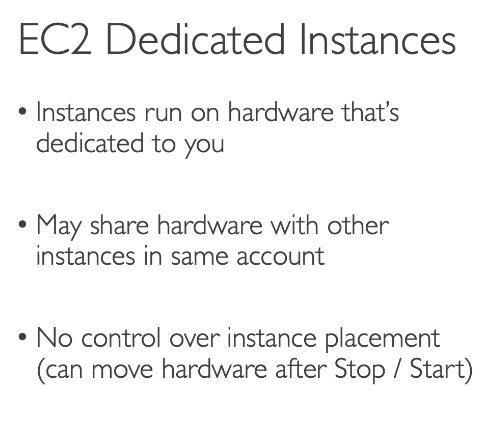
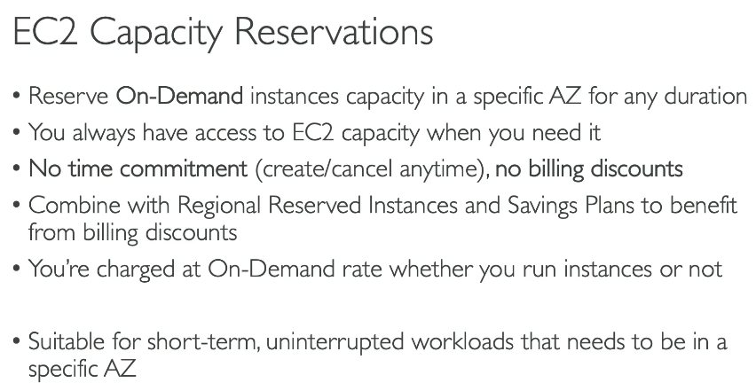
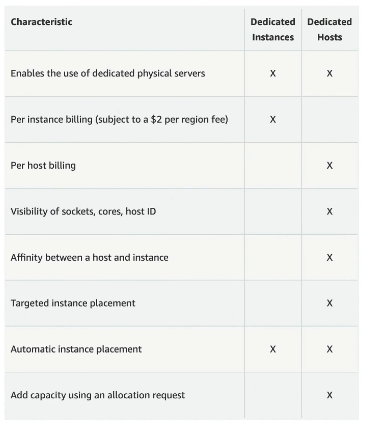
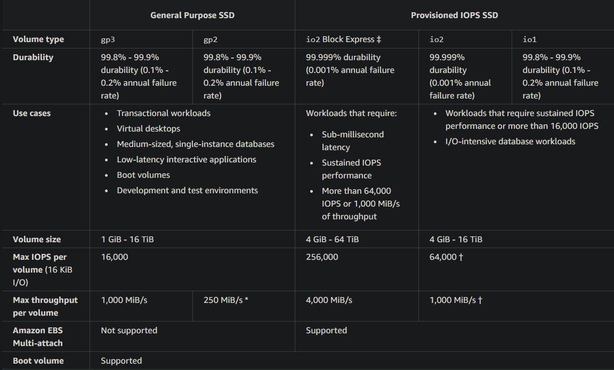
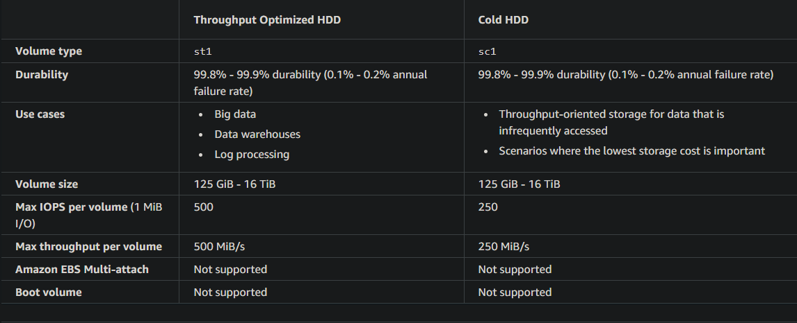

# EC2

- Storage in EC2 is an EBS volume.
- SSH int instance depends on your OS
- Common problem when sshing into machine is to have many permissions on your key (.pem) file. AES wants only you to have permission over that file and might complain. To fix it use `chmod 0400` on the file.
- For old versions of windows we need to use putty to convert .pem file into a .ppk file and also to connect to our instance using this .ppk file.
- Windows 10 already has ssh in the terminal.
- Use "Instance Connect" to get into instance from a browser based cli.
- EC2 **User Data**: 
    - Its used to **bootstrap your EC2** (which means launching commands when the machine starts).
    - The user data script **runs once at the instances first start (not on re-starts!!).**
    - In linux instances, the user data script is automatically ran with "sudo" permissions.
- EC2 Instance Naming Convention:

- EC2 Instance Types:
    - **General Purpose**:
        - Low-to-moderate CPU utilization workloads that may have spikes in utilization form now and then lead to wastage of CPU cycles and, as a result, you pay for more than you use (by provisioning at the spike level). To overcome this, you can leverage the **low-cost burstable general purpose instances, which are the T instances**. The baseline CPU is defined to meet the needs of the majority of general purpose workloads with the ability to burst above the baseline at any time for as long as required
    - **Compute optimized**: Computer intensive tasks/programs. All compute optimized instances are prefixed with letter **C**.
    - **Memory Optimized**: RAM optimized. Processing large datasets in memory. Typically they are prefixed with letter R (but others exist such as X and z).
    - Storage Optimized: When you require high sequential reads and write operations to large data sets on local storage. Typically prefixed with **i, D or H1**.
- The recommendation is to use reserved for baseline and then use on-demand or for peaks.
- Amazon EC2 instances support **multithreading**, which enables multiple threads to run concurrently on a single CPU core. **Each thread is represented as a virtual CPU (vCPU) on the instance**. An AWS vCPU is a single hyperthread of a two-thread Intel Xeon core (depending on instance). A simple way to think about this is that an **AWS vCPU is equal to half a physical core. (2 vCPU will result in 1 core which is in turn 1 thread).** See [this link](https://docs.aws.amazon.com/AWSEC2/latest/UserGuide/cpu-options-supported-instances-values.html) for more information on vCPUs and how they relate to physical cores and threads.
- **Security groups**:
    - SGs are a **firewall** on our EC2.
    - Controls how **traffic flows into and out from our EC2 instance**.
    - **They only contains allow rules.**
    - They can reference IPs or other SGs.
    - By **default** our EC2 is going to **allow all traffic out** of it and **block all traffic going in** to it.
    - SGs can be attached to multiple instances
    - **SGs are locked down to a region-VPC combination**.
    - **SGs operate at the instance level unlike ACLs which operate at the subnet level.**
    - SGs are **stateful**. If you send a request from your instance, the response traffic fro that request is allowed to flow in regardless of inbound rules.
    - Instances within the same SG do not have de possibility to communicate between them by default. You must explicitly add a rule for this.
        - The inbound rule that would allow many instances belonging to same SG to communicate is setting: All protocol, All prot number, All Ports and then reference the ID of the SG.
    - Its a **good idea to enable** **ICMP traffic** since its the protocol used to **ping instances**.
    - If you are using a load balancer, the SG associated with your load balancer must have rules that allow communication with your instances or targets. Also, the SG rules of your instances must allow the LB to communicate with your instances on both the listener port and the health check port.
- Common port to know:
    - SSH 22
    - FTP 21 (deploy files into file share)
    - SFTP 22: Using SSH to upload files
    - HTTP 80
    - HTTPS 443
    - RDP 3389 (log into windows instance through Remote Desktop Protocol)
- Remember that if your EC2 needs to access other services, you can create and attach an IAM role to it.
    - For example, each EC2 instance already comes with aws cli installed in it but you wont be able to access resources unless you log into your account through `aws configure` (NOT RECOMMENDED since credentials are stored in the instance) or you attach a role (RECOMMENDED approach) to the instance that will give it temporary credentials to operate other services.
- Instance Purchase Options:
    - On demand instances
    - Reserved
    - Savings Plans
    - Spot instances

- The **difference between Dedicated instance and Dedicated Host is**:
    - **Dedicated Instances** - Dedicated Instances are Amazon EC2 instances that run in a virtual private cloud (VPC) on hardware that's dedicated to a single customer. **Dedicated Instances that belong to different AWS accounts are physically isolated at a hardware level**, even if those accounts are linked to a single-payer account. However, Dedicated Instances **may share hardware with other instances from the same AWS account** that are not Dedicated Instances.
    -  An Amazon EC2 **Dedicated Host** is a physical server with EC2 instance capacity fully dedicated to your use. Dedicated Hosts allow you to use your existing software licenses on EC2 instances. With a Dedicated Host, you have **visibility and control over how instances are placed on the server**. This option is costlier than the Dedicated Instance.

- **Elastic IP**:
    - An elastic network interface is a **logical networking component** in a VPC that represents a virtual network card
    - An Elastic IP address is a **static IPv4 address designed for dynamic cloud computing**. An Elastic IP address is allocated to your AWS account, and is yours until you release it. By using an Elastic IP address, you **can mask the failure of an instance** or software by rapidly remapping the address to another instance in your account. Alternatively, you can specify the Elastic IP address in a DNS record for your domain, so that your domain points to your instance.
    - While your instance is running, you are not charged for one Elastic IP address associated with the instance, but you are charged for any additional Elastic IP addresses associated with the instance.
- **Elastic Network Interface**:
    - Its a point of **interconnection between a computer and a private or public network**. Its generally a network interface card (NIC), but does not need to be physical, it can also be implemented in software (virtual).
    - Each interface is associated with a physical or virtual network device.
    - The "loopback" interface (localhost) is an example of a virtual interface.
    - Its common for an administrator to configure one interface to service internet traffic (eth0), and another interface for a LAN or private network (eth1).
    - You can chose through which interface to send traffic through.
    - The amount of ENIs that can be attached to an instance depends on the type of instance.
    - Represents a virtual network card. **Its what gives an EC2 network connectivity.**
    - They are used outside of an EC2 instance, you can attach it to EC2s on the fly.
    - **They are bound to a specific AZ**
    - You can move ENIs between EC2 instances for failover purposes.
    - When you create an EC2, by default it has its own ENI with public and private IP. Once you attach another ENI to an EC2, you can access the instance through the ENIs IP.
    - "ETH0" is the default EC2 ENI, if you attach a new one it will appear as "ETH1" and so on. Those interfaces can be moved freely.
    - **Instances with multiple network cards provide higher network performance, including bandwidth capabilities above 100 Gbps and improved packet rate performance.**
- AMI
    - Customization of an EC2
    - **Made by AWS or by third party** (AWS Marketplace AMI).
    - They are **region specific** (and can be copied cross region).
- Storage:
    - **Instance Store**:
        - This is a **high-performance hardware disk** **(physical, not a network driver like EBS).**
        - Its an **ephemeral storage** (if you shut down your EC2 instance it is deleted)
        - Good for buffer, cache, scratch data and temporary content.
    - EFS
        - Its a **network file system** that can be mounted on many EC2 regardless of in which AZ the EC2 instance is.
        - **You can setup EFS to be multi AZ (great for prod).**
        - Use cases are content management, web service, data sharing and Wordpress.
        - Can be accessed by EC2s, ECS and lambdas.
        - Only compatible with Linux based AMI.
        - In practice, each AZ that has resources needing to access EFS connect to a Mount Target that lives inside each specific AZ. From there they access EFS. **A Mount Target (its an ENI) provides an IP address for an NFSv4 endpoint at which you can mount an amazon EFS.** You then mount your filesystem using its DNS name which resolves to the IP address of the EFS mount target in the same AZ as your EC2s.
        - There is **no capacity planning**! It automatically scales and you pay per use.
        - Encryption at rest with KMS is possible.
        - You can get thousands of NFS clients and 10 GBs throughput.
        - **Performance modes**:
            - **General Purpose**: latency-sensitive alternative like webserver, CMS, ttc.
            - **Max I/O**: Use for big data, media processing
        - **Throughput Mode**:
            - **Bursting:** 1TB = 50MiB/s and a burst of 100 MiB/s
            - **Provisioned**: Set throughput regardless of storage size.
        - **Storage Classes**
            - You can setup storage tiers.
            - Options are **Standard (frequent access)** and **Infrequent access (EFS-IA).** 
            - For infrequent access you must create a **Lifecycle policy** that switches from standard to infrequent. If you are using EFS in a single AZ then IA is called One-Sone-IA and it is much cheaper than a multi AZ EFS IA (although single AZ is not good for production).
            - The Standard–IA storage class reduces storage costs for files that are **not accessed every day**. It does this without sacrificing the high availability, high durability, elasticity, and POSIX file system access that Amazon EFS provides. AWS recommends Standard-IA storage if you need your full dataset to be **readily accessible** and want to automatically save on storage costs for files that are less frequently accessed.
    - EBS
        - Its the default volume for EC2. It works as a raw unformatted block device.
        - If EC2 is terminated you lose your data unless you use and attach a volume
        - Its **not a physical drive but a network drive** (can have some latency when communicating with instance).Thats why you can quickly detach it from one instance and attach it to another.
        - **You can only use one EBS per EC2 (unless you use Multi-Attach with io1/io2 family). But one EC2 may have more than one EBS attached to it.**
        - **Multi-Attach**: Attach **same EBS to more than one EC2**. Each instance has full read and write permissions. Apps must be able to resolve concurrent write situations to the volume.
        - They have a provisioned capacity (in GBs and IOPS). You can increase the capacity over time.
        - Encryption:
            - You need to enable it
            - Amazon **EBS automatically creates a unique AWS managed key in each Region where you store AWS resources**. This KMS key has the alias alias/aws/ebs. By default, Amazon EBS uses this KMS key for encryption. Alternatively, you can specify a symmetric customer managed encryption key that you created as the default KMS key for EBS encryption. If you enable it for a Region, you cannot disable it for individual volumes or snapshots in that Region.
            - **Amazon EBS does not support asymmetric CMKs. It uses symmetric encryption.**
            - You can configure your AWS account to **enforce the encryption** of the new EBS volumes and snapshot copies that you create
            - Operations occur on the servers that host EC2 instances, ensuring the security of both data-at-rest and data-in-transit between an instance and its attached EBS storage.
            - There is no direct way to encrypt an existing unencrypted volume or snapshot. **You can encrypt an unencrypted snapshot by copying and enabling encryption while copying the snapshot. To encrypt an EBS volume, you need to create a snapshot and then encrypt the snapshot as described earlier.** From this new encrypted snapshot, you can then create an encrypted volume.
        - When launching an EC2, the default is not to terminate the instances associated EBS when termination, but you can enable it so once EC2 is terminated, it also deletes the EBS. If the instance is already running, you can set DeleteOnTermination to False using the command line (cant be done through console).
        - When you create an EBS volume, it is **automatically replicated within its Availability Zone** to prevent data loss due to the failure of any single hardware component. **Each EBS volume is confined to an Availability Zone**
        - To see volumes attached to EC2: SSH into EC2 and run `lsblk` command.
        - When running on linux and need to attach an additional volume you need to create a file system for the EBS and format it before using it in the instance:
            - `lsblk`: You are going to see the primary EBS mounted and the secondary one (the one we are trying to use) unmounted.
            - `sudo file -s /dev/xvdb`: If the output of that commands is "dev/xvdb:data" then there is NO file system and we need to create one.
            - `sudo mkfs -t ext4 <device-name>`: This command creates an ext4 filesystem on the volume.
            - `sudo mount <device-name> <mount-point>` Mount our volume in some folder. Verify by running `sudo file -s /dev/xvdb`.
        - Snapshots:
            - Its a backup opf EBS volume
            - An EBS is restricted to one AZ. **If you need to move a EBS to another AZ you need to use a snapshot**.
            - You can user EBS Snapshot Archive to store snapshots 75% cheaper in an S3 but have 72 hrs to retrieve it. You can also setup policies for deletion of the snapshots (specifying a retention period for snapshots).
        - **Storages are characterized by Size, Throughput and IOPS.**
        - When IOPS depends on storage then how small/large the size is determines performance. Eg: If you need a 25 gb storage but performance of 600 IOPS, assuming no other option is available you would need to provision a 200GB volume despite not needing that much size.
        - [Types of EBS](https://docs.aws.amazon.com/AWSEC2/latest/UserGuide/ebs-volume-types.html):
            - **General Purpose SSD:**
                - Cost effective and low-latency. Ideal for develop and test envs.
                - gp3
                    - Baseline rate of 3,000 IOPS and 125 MiB/s
                    - The maximum ratio of **provisioned IOPS to provisioned volume size** is **500 IOPS per GiB**.
                    - The maximum ratio of **provisioned throughput to provisioned IOPS** is **.25 MiB/s per IOPS**. 
                    - Eg: 
                        - 32 GiB or larger: 500 IOPS/GiB × 32 GiB = 16,000 IOPS
                        - 8 GiB or larger and 4,000 IOPS or higher: 4,000 IOPS × 0.25 MiB/s/IOPS = 1,000 MiB/s
                - gp2
                    - **Minimum of 100 IOPS** (at 33.33 GiB and below) and a **maximum of 16,000 IOPS** (at 5,334 GiB and above)
                    - Has **burst performance** (works together with [credit balances](https://docs.aws.amazon.com/AWSEC2/latest/UserGuide/ebs-volume-types.html))
                    - 3 IOPS per GiB of volume size
                    - Throughput calculated by 
                        - Throughput in MiB/s = ((Volume size in GiB) × (IOPS per GiB) × (I/O size in KiB))
            - **Provisioned IOPS SSD**
                - Designed to meet the needs of I/O-intensive workloads, particularly database workloads, that are sensitive to storage performance and consistency. 
                - io2 Block Express
                    - Suited for workloads that benefit from a single volume that provides sub-millisecond latency, and supports higher IOPS, higher throughput, and larger capacity than io2 volumes.
                    - Multi-Attach and encryption support
                    - io2 volumes and io2 Block Express volumes are billed at the same rate.
                - io2
                    - The maximum ratio of provisioned IOPS to requested volume size (in GiB) is 500:1.
                    - linear increase in throughput at a rate of 16 KiB per provisioned IOPS
                - io1
                    - The maximum ratio of provisioned IOPS to requested volume size (in GiB) is 50:1.
                    - linear increase in throughput at a rate of 16 KiB per provisioned IOPS
            - **Throughput optimized HDD volumes**
                - Low-cost magnetic storage that defines performance in terms of throughput rather than IOPS. This volume type is a good fit for large, sequential workloads such as Amazon EMR, ETL, data warehouses, and log processing.
                - st1:
                    - Are designed to support frequently accessed data.
                    - Involving large, sequential I/O, and we recommend that customers with workloads performing small, random I/O use gp2
                    - Like gp2, it works with Throughput credits and burst performance
                    - Volume size determines the baseline throughput of your volume, which is the rate at which the volume accumulates throughput credits. Volume size also determines the burst throughput of your volume, which is the rate at which you can spend credits when they are available.
            - Cold HDD volumes (sc1)
                - low-cost magnetic storage that defines performance in terms of throughput rather than IOPS. 
                - If you require infrequent access to your data and are looking to save costs
                - Like gp2, sc1 it works with Throughput credits and burst performance
            
            

## Notes from practice tests
- EC purchase options:
    - On-demand
        - You pay for compute capacity by the second with no long-term commitments.
        - Capacity reservations
            - Enable you to **reserve compute capacity** for your Amazon EC2 instances **in a specific Availability Zone** for any duration
            - You ensure that you always have access to EC2 capacity when you need it, for as long as you need it. You can create Capacity Reservations at any time, without entering into a one-year or three-year term commitment. **The capacity becomes available and billing starts as soon as the Capacity Reservation is provisioned in your account.**
            - In addition, you can use Savings Plans and Regional Reserved Instances with your Capacity Reservations to benefit from billing discounts.
            - **When you create a Capacity Reservation, you specify: AZ, number of instances, type, tenancy and OS.**
    - Reserved Instance
        - Fix instance type, size, tenancy, OS, scope (regional or a single AZ)
        - You can buy and sell in the Reserved Instance Market Place
        - If you want flexible instance type, scope, tenancy, OS you can use **Convertible Reserved Instance** (but has a bit less discount)
    - Savings Plan
        - Same discount as RI but you commit to instance usage (eg: 10 $/hr)
        - Usage beyond savings plan is billed as on-demand
        - **Locked to specific region and instance family**
        - Flexible across instance size, Os and tenancy (default, hosted or dedicated)
    - Spot instance
- Tenancies:
    - Dedicated Host
        - Physical server with EC2 instance capacity fully dedicated to your use.
        - Dedicated Hosts allow you to use your existing per-socket, per-core, or per-VM software licenses
        - **Allows you to consistently deploy your instances to the same physical server over time**
        - Provides additional visibility and control over how instances are placed on a physical server
        - **Billing per physical host**
    - Dedicated Instance
        - Instances that run in a virtual private cloud (VPC) on hardware that's dedicated to a single customer. Dedicated Instances that belong to different AWS accounts are physically isolated at a hardware level, even if those accounts are linked to a single payer account. However, Dedicated Instances **might share hardware with other instances from the same AWS account that are not Dedicated Instances.**
        - **Billing per instance launched**

- Key pairs on EC2:
    -  Amazon EC2 stores the public key on your instance, and you store the private key.
    - When your instance boots for the first time, the public key that you specified at launch is placed on your Linux instance in an entry within ~/.ssh/authorized_keys.
    - Because Amazon EC2 doesn't keep a copy of your private key, there is no way to recover a private key if you lose it. 
    - You can **change the key pair** that is used to access the default system account of your instance by a**dding a new public key on the instance, or by replacing the public key (deleting the existing public key and adding a new one) on the instance.** You can also remove all public keys from an instance.

- Spot instance interruptions
    - When Amazon EC2 reclaims a Spot Instance, we call this event a Spot Instance interruption.
    - When Amazon EC2 interrupts a Spot Instance, it either **terminates, stops, or hibernates** the instance, depending on what you specified when you created the Spot request.

- Monitoring
    - **By default, Amazon EC2 sends metric data to CloudWatch in 5-minute periods.** To send metric data for your instance to CloudWatch in **1-minute period**s, you can enable **detailed monitoring** on the instance. 
    - Enable detailed monitoring when launching instance `aws ec2 run-instances --image-id ami-09092360 --monitoring Enabled=true...`
    - Enable detailed monitoring for an existing instance `aws ec2 monitor-instances --instance-ids i-1234567890abcdef0`
    - Turn off detailed monitoring `aws ec2 unmonitor-instances --instance-ids i-1234567890abcdef0`

- To view all categories of **instance metadata** from within a running instance, use the http://169.254.169.254/**latest/meta-data/** URI. Note that the IP address 169.254.169.254 is a **link-local address** and is valid only **from within the instance.**