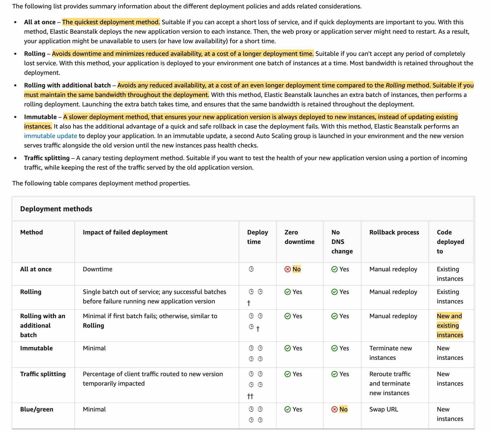
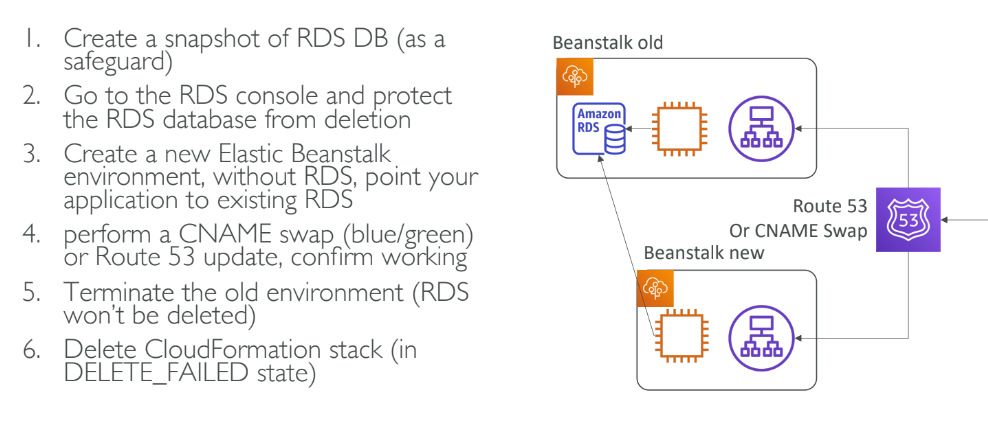
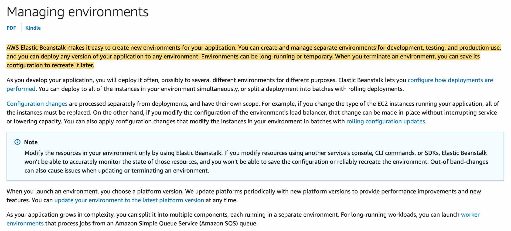

# ElasticBeanstalk

- Run code and don't think much about underlying infrastructure.
- Pay for underlying infra actually used
- Three architecture modes 
    - Single Instance
    - High Availability
    - ASG Only
- To see complete trail of **actions done by beanstalk** go to **Events** and **filter logs buy INFO**
- Important: 
    - If EB creates an RDS DB then if environment is deleted then RDS is also deleted!
    - If you select a certain type of LB on creation then you cannot change it later on.
- Deployment modes:
    - **All at once**: 
        - Short loss of service. Its the default. All the instances are updated simultaneously, does not result in loss of EC2 burst balances.
    - **Rolling**: 
        - If bucket size is small and there are many instances then it may take a lot of time. Rolling deployments **do not result in loss of EC2 burst balances**.
    - **Rolling with additional batches**: 
        - Ideal for production We are sure that we are always running on at capacity.
    - **Immutable**: 
        - Also great for production but more expensive. A **new TEMPORARY ASG** with new app version is deployed. When stable, the instances are moved to the actual prod ASG and TEMP ASG is deleted.
        - Perform an immutable update to launch a full set of new instances running the new version of the application in a separate Auto Scaling group, alongside the instances running the old version. Immutable deployments can prevent issues caused by partially completed rolling deployments.
    - **Traffic-splitting (CANARY)**:
        - Uses Load Balancer
        - Let you perform canary testing as part of your application deployment. In a traffic-splitting deployment, Elastic Beanstalk launches a full set of new instances **just like during an immutable deployment**. It then forwards a specified percentage of incoming client traffic to the new application version for a specified **evaluation period**.
    - **Blue/green**:
        - Uses **DNS Change**
        - Launch a full set of new instances **just like during an immutable deployment**.

- Some Deployment policies replace all instances during the deployment or update. This causes all accumulated Amazon EC2 **burst balances to be lost**. It happens in the following cases:
    - Managed platform updates with instance replacement enabled
    - Immutable updates
    - Traffic splitting
    - Blue/Green
- Blue Green deployment on Beanstalk:
    - **Its not a feature but a technique**
    - Configure blue and green envs
    - Perform a **weighted routing in Route 53** to each env (e.g: 70% to blue and 30% to green).
    - When satisfied with app, perform a **CNAME swap** in Route 53 to send all traffic to green environment.
- There is a custom CLI for beanstalk that helps you automate your EB deployment pipelines.
- **Failed deployments:**
    - When processing a batch, Elastic Beanstalk **detaches all instances** in the batch from the load balancer, **deploys the new application** version, and then **reattaches the instances**. If you enable **connection draining**, Elastic Beanstalk drains existing connections from the Amazon EC2 instances in each batch before beginning the deployment.
    - If a deployment fails after one or more batches completed successfully, the **completed batches run the new version of your application while any pending batches continue to run the old version**. You can identify the version running on the instances in your environment on the health page in the console. This page displays the deployment ID of the most recent deployment that was executed on each instance in your environment. **If you terminate instances from the failed deployment, Elastic Beanstalk replaces them with instances running the application version from the most recent successful deployment.**
- Lifecycle policies:
    - Used because you can have at most **1000 versions at most**. You remove them with lifecycle policies from your EB interface. Nevertheless, you can store these version in S3 for potential future use (retain or delete source bundle).
    - Can be based on time (age of a version) or space (how many versions you want to retain)
- EB Extensions:
    - Use folder **.ebextensions** to configure the same parameters set in the UI (must be in root of source code). **All files in this folder must be with .config extension.** (source code is uploaded in a .zip).
    - Additional resources can also be specified here like DBs.
    - Any resources created as part of your .ebextensions is part of your Elastic Beanstalk template and **will get deleted if the environment is terminated** (resource lifecycle is tied up to EB environment lifecycle).
    - The option_settings section of a configuration file defines values for configuration options. Configuration options let you configure your Elastic Beanstalk environment, the AWS resources in it, and the software that runs your application. Configuration files are only one of several ways to set configuration options.
- Beanstalk and CloudFormation: **EB runs on CF** so you can configure resources directly from .ebextensions folder. After that EB creates a CF stack with its own template.
- **EB allows you to clone one environment to another (maintaining config). Ideal to create test env from production one.**
- EB migration steps (for example to change the LB from an existing environment).
    - Create new env with new type of LB
    - Deploy app on new environment
    - Perform a CNAME swap or Route 53 DNS update to point to new env.
- EB can provision RDS DB for test /dev environments. But **for prod its better to create DB separately** and then connect them through conn string.
- What if you want to decouple an RDS from an EB environment?
    - Create snapshot of RDS DB (as a backup)
    - Protect RDS from deletion (through console. This is just in case)
    - Create a new EB environment but without RDS and point app to our RDS from previous point.
    - Perform CNAME swap in Route 53 from old EB (with RDS in it) to new EB (without RDS in it).
    - Terminate old EB. RDS wont be deleted because we protected it form deletion.
    - To allow the Amazon EC2 instances in your environment to connect to an outside database, you can configure the environment's Auto Scaling group with an additional security group. The security group that you attach to your environment can be the same one that is attached to your database instance, or a separate security group from which the database's security group allows ingress.
    - You can connect your environment to a database by adding a rule to your database's security group that allows ingress from the autogenerated security group that Elastic Beanstalk attaches to your environment's Auto Scaling group. However, doing so creates a dependency between the two security groups. Subsequently, when you attempt to terminate the environment, Elastic Beanstalk will be unable to delete the environment's security group because the database's security group is dependent on it.
    
- **You can use EB for single or multiple docker containers**:
    - For **single containers**, EB does not use ECS (it justs uses **docker on EC2**)
    - **Multiple containers**: **EB creates an ECS cluster with ASG on EC2s, LBS and task definitions.** Just need to provide a **Dockerrun.aws.json** an root of source code. This is used to create ECS task definitions. Images must be prebuilt and in a registry.
    - You need to provide Dockerfile or Dockerrun.aws.json
    - 
- EB **custom platform**:
    - Allows you to **define OS, Additional Software and scripts**. Requires you to create an **AMI using Platform.yaml** file and Packer software (open source tool to create AMIs). Use this if app language is incompatible with Beanstalk or doesn't use docker containers.
    - **Don't confuse custom platform with custom image (AMI)**:
        - Custom Image is to tweak an existing EB Platform (Python, Node, Java, etc)
        - Custom Platform is it create an entirely new EB Platform.

## Quiz
- App versions can be deployed to one or many environments? -> MAny
- I would like to update my EB app so that we are able to rollback very quickly in case of issues with the new app version. Which deployment mode is the best fit?
    - Immutable: To rollback quickly this mode terminates temporary ASG that has new version while current one is untouched and already running at capacity.
- You would like to perform set of repetitive and scheduled tasks asynchronously. Which EB env should be setup>? A worker env with a **cron.yaml** file.

## Notes from practice tests
- How rolling deployments work
    - When processing a batch, Elastic Beanstalk detaches all instances in the batch from the load balancer, deploys the new application version, and then reattaches the instances.
    - After reattaching the instances in a batch to the load balancer, Elastic Load Balancing waits until they pass a minimum number of Elastic Load Balancing health checks (the Healthy check count threshold value), and then starts routing traffic to them.
    - **Elastic Beanstalk waits until all instances in a batch are healthy before moving on to the next batch.**
    - If a batch of instances does not become healthy within the command timeout, the deployment fails. Then perform another deployment with a fixed or known good version of your application to roll back.
    - If a **deployment fails after one or more batches completed successfully**, the **completed batches run the new version** of your application while any **pending batches continue to run the old version.**

- **Dedicated worker environment** 
    - If your AWS Elastic Beanstalk application performs operations or workflows that take a long time to complete, you can offload those tasks to a dedicated worker environment. Decoupling your web application front end from a process that performs blocking operations is a common way to ensure that your application stays responsive under load.
    - You can define periodic tasks in a file named **cron.yaml** in your source bundle to add jobs to your worker environment's queue automatically at a regular interval. For example, you can configure and upload a cron.yaml file which creates two periodic tasks: one that runs every 12 hours and a second that runs at 11pm UTC every day. Eg: the following cron.yaml file creates two periodic tasks. The first one runs every 12 hours and the second one runs at 11 PM UTC every day. The name must be unique for each task. The URL is the path to which the POST request is sent to trigger the job.
    - 
    ```yaml
    version: 1
    cron:
        - name: "backup-job"
            url: "/backup"
            schedule: "0 */12 * * *"
        - name: "audit"
            url: "/audit"
            schedule: "0 23 * * *"
    ```

- Environments:
    - AWS Elastic Beanstalk makes it easy to create new environments for your application. You can create and manage separate environments for development, testing, and production use, and you can deploy any version of your application to any environment. Environments can be long-running or temporary. When you terminate an environment, you can save its configuration to recreate it later.
    - **It is common practice to have many environments for the same application**. You can deploy multiple environments when you need to run multiple versions of an application.
    

- Docker platforms:
    - **Multi-docker platform**: Use the Multicontainer Docker platform if you need to **run multiple containers on each instance**. The Multicontainer Docker platform does not include a proxy server. Elastic Beanstalk uses Amazon Elastic Container Service (Amazon ECS) to coordinate container deployments to multi-container Docker environments.
    - **Single-container platform**: Use the Single Container Docker platform if you only need to run a single Docker container on each instance in your environment. The single container platform includes an Nginx proxy server.

- With ElasticBeanstalk, you can:
    - Select the operating system that matches your application requirements (e.g., Amazon Linux or Windows Server 2016)
    - Choose from several Amazon EC2 instances, including On-Demand, Reserved Instances, and Spot Instances.
    - Choose from several available database and storage options.
    - Enable login access to Amazon EC2 instances for immediate and direct troubleshooting
    - Quickly improve application reliability by running in more than one Availability Zone.
    - Enhance application security by enabling HTTPS protocol on the load balancer
    - Access built-in Amazon CloudWatch monitoring and getting notifications on application health and other important events
    - Adjust application server settings (e.g., JVM settings) and pass environment variables
    - Run other application components, such as a memory caching service, side-by-side in Amazon EC2.
    - Access log files without logging in to the application servers

- When you use the AWS Elastic Beanstalk console to deploy a new application or an application version, you'll need to upload a source bundle. Your source bundle must meet the following requirements:
    - Consist of a **single ZIP file or WAR file** (you can include multiple WAR files inside your ZIP file)
    - **Not exceed 512 MB**
    - **Not include a parent folder or top-level directory** (subdirectories are fine)

- Elastic Beanstalk regularly releases new platform versions to update all Linux-based and Windows Server-based platforms. **New platform versions** provide updates to existing software components and support for new features and configuration options. Elastic Beanstalk recommends one of two methods for performing platform updates:
    - **Update your Environment's Platform Version**: when you're updating to the latest platform version, **without a change** in runtime, web server, or application server versions, and without a change in the major platform version. 
    - **Perform a Blue/Green Deployment**: This is the recommended method when you're updating to a different runtime, web server, or application server versions, or to a different major platform version. 

- In Elastic Beanstalk, you can include a YAML formatted environment manifest in the root of your application source bundle to configure the environment name, solution stack and environment links to use when creating your environment. An environment manifest uses the same format as Saved Configurations.

- This file format includes support for environment groups. To use groups, specify the environment name in the manifest with a + symbol at the end. When you create or update the environment, specify the group name with --group-name (AWS CLI) or --env-group-suffix (EB CLI). The following example manifest defines a web server environment for the tutorialsdojo frontend application, with a link to a worker environment component that it is dependent upon. The manifest uses groups to allow creating multiple environments with the same source bundle:

    ~/tutorialsdojo/frontend/env.yaml 
    ```yaml
    AWSConfigurationTemplateVersion: 1.1.0.0
    SolutionStack: 64bit Amazon Linux 2015.09 v2.0.6 running Multi-container Docker 1.7.1 (Generic)
    OptionSettings:
    aws:elasticbeanstalk:command:
        BatchSize: '30'
        BatchSizeType: Percentage
    aws:elasticbeanstalk:sns:topics:
        Notification Endpoint: me@example.com
    aws:elb:policies:
        ConnectionDrainingEnabled: true
        ConnectionDrainingTimeout: '20'
    aws:elb:loadbalancer:
        CrossZone: true
    aws:elasticbeanstalk:environment:
        ServiceRole: aws-elasticbeanstalk-service-role
    aws:elasticbeanstalk:application:
        Application Healthcheck URL: /
    aws:elasticbeanstalk:healthreporting:system:
        SystemType: enhanced
    aws:autoscaling:launchconfiguration:
        IamInstanceProfile: aws-elasticbeanstalk-ec2-role
        InstanceType: t2.micro
        EC2KeyName: workstation-uswest2
    aws:autoscaling:updatepolicy:rollingupdate:
        RollingUpdateType: Health
        RollingUpdateEnabled: true
    Tags:
    Cost Center: WebApp Dev
    CName: front-A08G28LG+
    EnvironmentName: front+
    EnvironmentLinks:
    "WORKERQUEUE" : "worker+"
    ```

- [Deploying app in EB using CLI](https://www.youtube.com/watch?v=UVjYHgNMzpg)
    - `eb init`
        - You need to have aws cli enabled and configured so eb cli can communicate with AWS
        - You have the option to specify SSH key pair to access individual EC2 instances.
    - `eb create`
        - Specify env name
        - Specify unique CNAME prefix
        - Specify ELB to use
        - This command crates app, creates env (ALB, EC2s, ASGs, SGs, CW alarms for scaling), uploads source files to AWS
    - `eb config`
        - Modify env configurations (ALB, EC2s, ASGs, SGs, CW alarms for scaling)
        - Changes made here will update environment accordingly
    - `eb logs`
        - Get list of logs
    - `eb health`
        - Health status of instances
    - `eb events`
    - `eb status`
    - `eb open`
        - Open app in browser 
    - `eb terminate`
    - `eb deploy`
