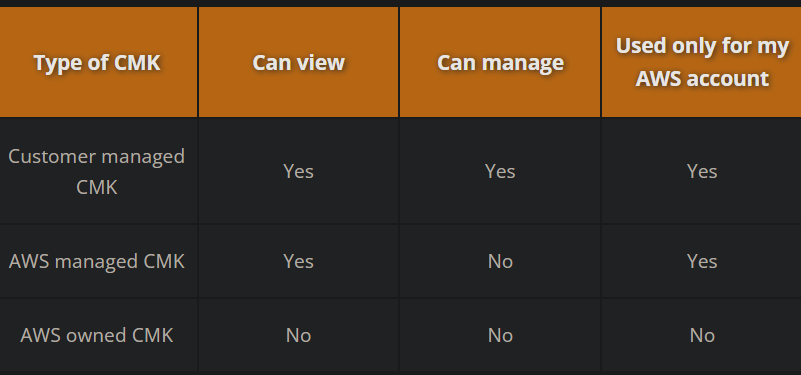
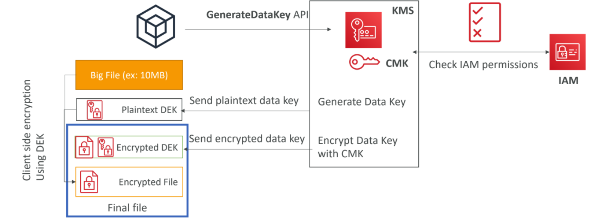
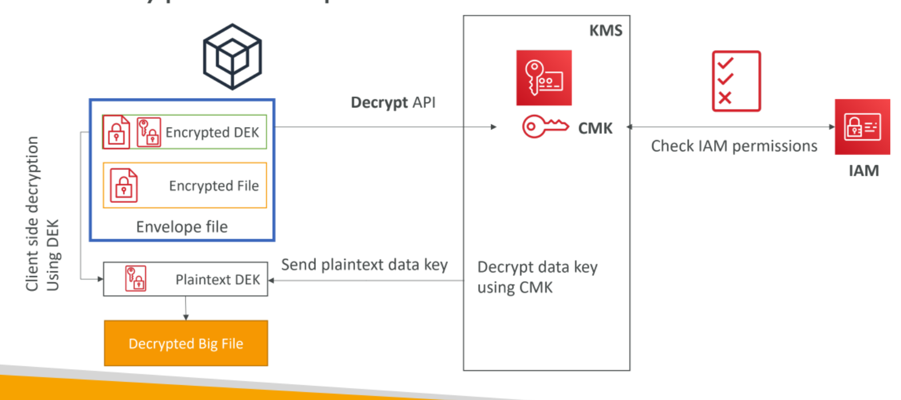

# KMS

- Able to fully manage the keys and policies (Create, Rotations policies, Disable, Enable).
- Three types fo Customer Master Keys (CMK)
    - **AWS Managed Service Default CMK: Free**
    - **User keys created** in KMS ($1 per month)
    - **User key imported** (256-bit symmetric key, $1 per month)
- Master keys stored in AWS KMS, known as customer master keys (CMKs), **never leave the AWS KMS FIPS validated hardware security modules unencrypted.**
- Typically, **you use CMKs to generate, encrypt, and decrypt the data keys that you use outside of KMS to encrypt your data.**
    - Types of CMK 
        - Customer Managed CMK: You have **full control over these CMKs**, including establishing and maintaining their **key policies**, **IAM policies**, and grants, enabling and disabling them, **rotating** their cryptographic material, adding tags, creating **aliases** that refer to the CMK, and **scheduling the CMKs for deletion.**
            - When you enable **automatic key rotation** for a customer managed CMK, KMS generates new cryptographic material for the CMK **every year**. KMS also saves the CMK’s older cryptographic material so it can be used to decrypt data that it encrypted.
            - There are also types of CMKs that are **not eligible for automatic key rotation** such as asymmetric CMKs (symmetric CMKs are supported), CMKs in custom key stores, and CMKs with imported key material.
            - Each CMK can have **multiple aliases**, but **each alias points to only one CMK**. The alias name must be **unique** in the AWS account and region.
        - AWS managed CMK:  **created, managed, and used on your behalf by an AWS service** that integrates with KMS. You can view the AWS managed CMKs in your account, view their key policies, and audit their use in CloudTrail logs. However, you **cannot manage these CMKs or change their permissions**. And, you **cannot use AWS managed CMKs in cryptographic operations directly**; the service that creates them uses them on your behalf.
        - AWS owned CMKs: **Not in your AWS account**. They are part of a collection of CMKs that AWS owns and manages for use in multiple AWS accounts. **AWS services can use AWS owned CMKs to protect your data.** You cannot view, manage, or use AWS owned CMKs, or audit their use. 
- $0.03 per 10000 API calls.
- KMS can only help in payloads **up to 4KB of data per call**.
- Keys:
    - Symmetric key (AES-256 keys)
        - Used in envelope encryption
        - You never get access to the unencrypted key (you must call AWS KMS api)
    - Asymmetric (RSA and ECC key pairs)
        - Public and private keys
        - Used in cases where encryption is needed outside of AWS by users who cant call the KMS API.
- Keys are **region bound**
    - What if you want to copy an encrypted EBS volume to another region?
        - **ReEncrypt** snapshot with Key B (in second region)
        - Restore EBS volume from snapshot in second region
    
- Access to a key depends on the **KMS Key policy** and **IAM policy** of the user. **Having a key policy is mandatory** (not like S3 bucket policy that may or may not exist). **Default key policy is very permissive since it gives full access to users and roles** (not other AWS services), so you need to control it with IAM policies. Use custom KMS key policy by define principals that can access key, who can administer it. **Useful for cross-account access to KMS.** Used when you share encrypted snapshots cross accounts

- Envelope Encryption:
    - The practice of **encrypting plaintext data with a data key, and then encrypting the data key under another key**. The top-level plaintext key encryption key is known as the master key.
    - **Use if you need to encrypt more than 4KB**
    - The main API used for this is **`GenerateDataKey` (a symmetric key)**
    - AWS provides **Encryption SDK** that implements this and also provides a CLI tool to perform it. These tools have a feature to cache data keys to reduce calls to KMS (security vs cost tradeoff). Encryption SDK only encrypts your data using a symmetric key algorithm.
    - Steps encrypt:
        - You **ask KMS for a Data key**. In that request you specify which CMK to use.
        - KMS checks permissions on CMK
        - **KMS sends plaintext Data Encryption Key called DEK and the encrypted version of the DEK.**
        - **Client encrypts the data using DEK**.
        - Client then creates an "Envelope", formed out of:
            - **Encrypted data**
            - **Encrypted DEK** (the one sent in the third step bu KMS)
    
    - Steps Decrypt
        - **Ask KMS to decrypt the DEK**
        - User gets plain text version of DEK
        - **Decrypt file using plaintext DEK**
    
    - A `GenerateDataKeyWithoutPlainText` is also used when **you only want the encrypted version of the DEK that you will use later to encrypt a file.** When you want to use it, you need to call the `Decrypt` API on the key.
    - The `GenerateDataKeyWithoutPlaintext` API generates a unique data key. This operation returns a data key that is encrypted under a customer master key (CMK) that you specify. `GenerateDataKeyWithoutPlaintext` is identical to `GenerateDataKey` except that it **returns only the encrypted copy of the data key**.
    -  When you encrypt data directly with AWS KMS it must be transferred over the network. Envelope encryption reduces the network load since only the request and delivery of the much smaller data key go over the network. The data key is used locally in your application or encrypting AWS service, avoiding the need to send the entire block of data to AWS KMS and suffer network latency.
- Limits
    - `ThrottlingException`
    - Remember that every service that uses KMS adds to the limits!
    - Some solutions:
        - **Exponential back off**
        - **Request quota increase**
        - For **envelope encryption** use Data keys encryption.
- While **AWS KMS does support sending data up to 4 KB to be encrypted directly**, envelope encryption can offer significant performance benefits. When you encrypt data directly with AWS KMS it must be transferred over the network. **Envelope encryption** reduces the network load since only the request and delivery of the much smaller data key go over the network. The data key is **used locally in your application or encrypting AWS service**, avoiding the need to send the entire block of data to AWS KMS and suffer network latency. AWS Lambda environment variables can have a maximum size of 4 KB. Additionally, the direct 'Encrypt' API of KMS also has an upper limit of 4 KB for the data payload. **To encrypt 1 MB, you need to use the Encryption SDK and pack the encrypted file with the lambda function**.

# Notes from practice tests
- You can connect directly to AWS KMS through a private endpoint in your VPC instead of connecting over the Internet. When you use a **VPC endpoint**, **communication between your VPC and AWS KMS is conducted entirely within the AWS network**. You can define VPC Endpoint policies, enabling you to increase the granularity of your security controls by specifying which principals can access your endpoint, which API calls they can make, and which resources they can access.

- **Deleting a CMK deletes the key material and all metadata** associated with the CMK and is irreversible. You can no longer decrypt the data that was encrypted under that CMK, which means that **data becomes unrecoverable**.

- **In general, symmetric key algorithms are faster and produce smaller ciphertexts than public-key algorithms. But public-key algorithms provide inherent separation of roles and easier key management.**

- **AWS CloudHSM** is a cloud-based **hardware security module** (HSM) that enables you to easily generate and use your own encryption keys on the AWS Cloud. **CloudHSM is level 3 compliant while KMS is level 2 compliant.** CloudHSM gives a **single-tenant multi-AZ cluster**, and it’s exclusive to you. **KMS is multitenant**; however, it uses HSMs within, but those are distributed over customer accounts, so it’s not exclusive only for you.

- You should **consider using AWS CloudHSM instead of AWS KMS if** you require:
    - Keys stored in dedicated, third-party validated hardware security modules under your exclusive control.
    - FIPS 140-2 compliance.
    - Integration with applications using PKCS#11, Java JCE, or Microsoft CNG interfaces.
    - High-performance in-VPC cryptographic acceleration (bulk crypto).

- You can perform the following key management functions in AWS KMS:
    - **Create symmetric and asymmetric keys where the key material is only ever used within the service**
    - **Create symmetric keys where the key material is generated and used within a custom key store under your control.**
    - Import your own symmetric key for use within the service.
    - Create both symmetric and asymmetric data key pairs for local use within your applications.
    - Define which IAM users and roles can manage keys.
    - Define which IAM users and roles can use keys to encrypt and decrypt data.
    - Choose to have keys that were generated by the service to be automatically rotated on an annual basis.
    - Temporarily disable keys so they cannot be used by anyone.
    - Re-enable disabled keys.
    - Schedule the deletion of keys that you no longer use.
    - Audit the use of keys by inspecting logs in AWS CloudTrail.