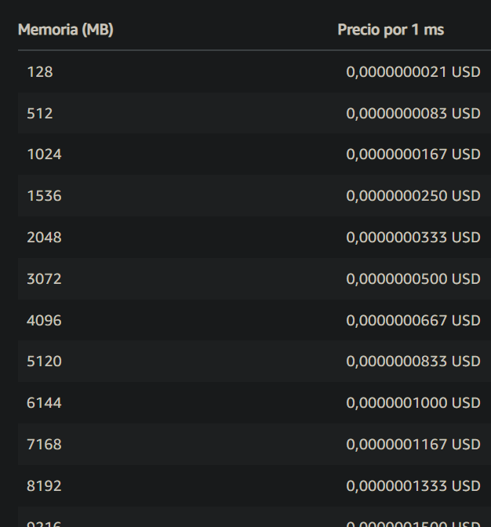
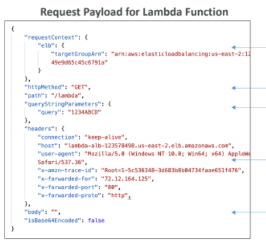
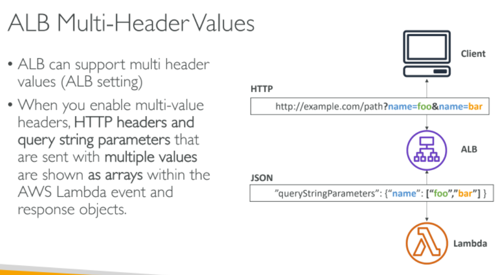
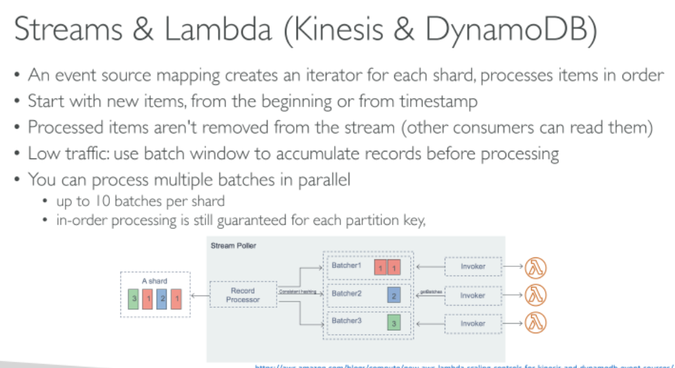
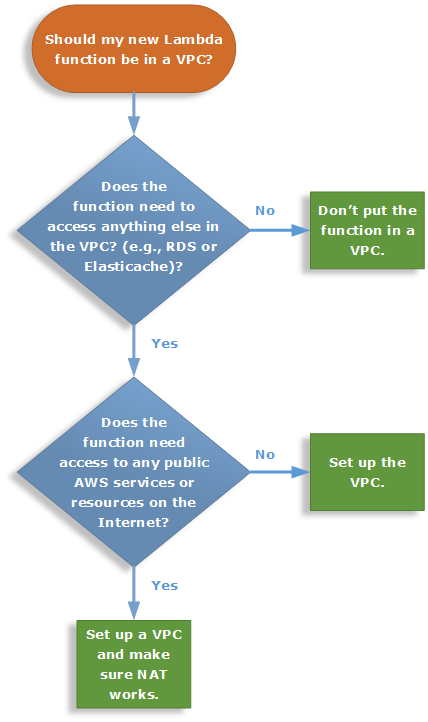
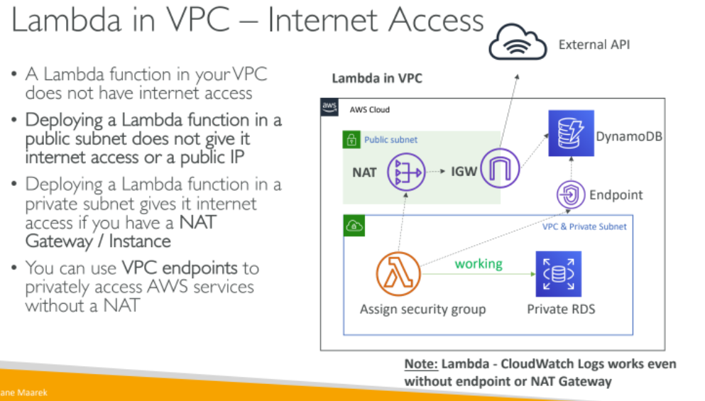
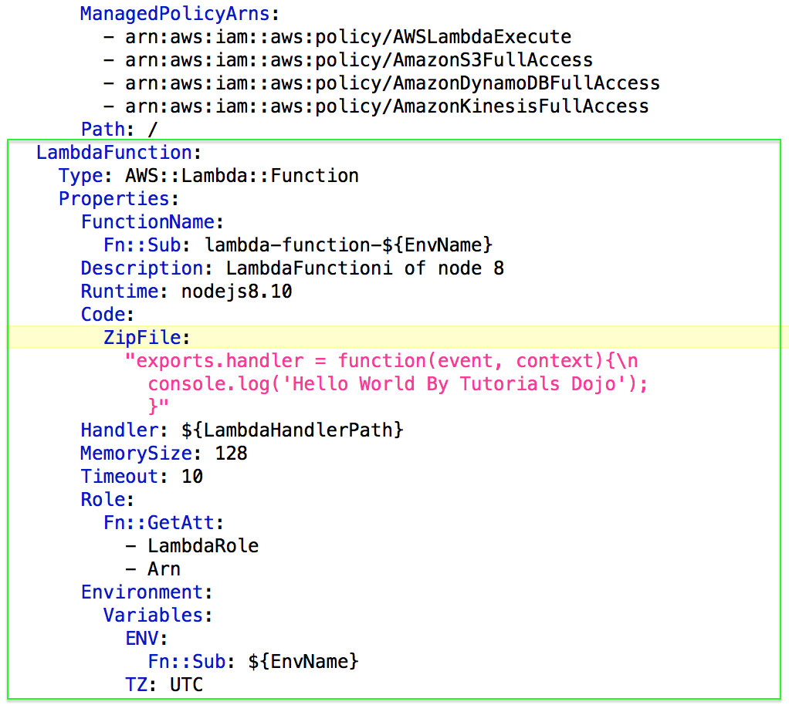

# Lambda

- **Price depends on assigned memory**. Other resources such as CPU go in parallel with memory size.
- Lambda allocates CPU power in proportion to the amount of memory configured. Memory is the amount of memory available to your Lambda function at runtime. You can increase or decrease the memory and CPU power allocated to your function using the Memory (MB) setting. To configure the memory for your function, set a value **between 128 MB and 10,240 MB in 1-MB increments. At 1,769 MB, a function has the equivalent of one vCPU (one vCPU-second of credits per second).**
- Los cargos de duración se aplican al código que se ejecuta en el gestor de una función, así como al código de inicialización que se declara fuera del gestor. 
- El **nivel gratuito** de AWS Lambda incluye **1 millón de solicitudes gratuitas al mes y 400 000 GB-segundos de tiempo de computación al mes**, utilizables para funciones con x86 y procesadores Graviton2, en conjunto.
- **You pay $1 for every 600.000 seconds if funtion is 1GB of RAM.**
- You pay depending on the functions GB / s (se redondea al 1 ms más cercano).

- Los costos del almacenamiento efímero dependen de la cantidad de almacenamiento efímero que se asigne a la función y de la duración de ejecución de la función, medida en milisegundos. **Puede asignar a la función cualquier cantidad adicional de almacenamiento entre 512 MB (los 512 son sin costo adicional, de ahi para arriba se cobra) y 10 240 MB en incrementos de 1 MB**
- **Lambda@Edge** cuenta una solicitud cada vez que comienza a ejecutarse en respuesta a un evento de Amazon CloudFront globalmente. **Se cobra por solicitud y duracion.**
- Lambdas have IAM roles to integrate with other AWS services.
- **Lambdas create one CW log stream per invocation**.
- You can invoke **lambdas synchronously** (errors and retries must be handled by client caller)
- **Lambdas and ALB (sync invocation):**
    - When integrating ALB with lambda, the **ALB performs HTTP to JSON conversion** so lambda can execute and then, after execution, ALB performs JSON response to HTTP to send response to client. (Lambdas i/o is JSON). Note this is a case of sync invocation.
    
    - ALB also **supports multi-header values** in JSON conversion
    
    - **ALB health checks to lambdas count as an invocation!**
- **Lambda@Edge:**
    - View CloudFront README.md
    - You can generate response directly from edge location instead of calling origin if you wanted to.
- **Async invocations:**
    - In an async type invocation, lambda performs retries by itself. **3 retries in total with an exponential back** off strategy. If errors persist you can send message to DLQ.
    - **Default 3 seconds before timeout, maximum is 900 seconds (15 minutes)**
    - **Make sure processing is idempotent (in case of retries).**
    - Status codes will not be 200 OK byt **202 ACCEPTED**.
    - Retries and **DLQs** can be set in the async configuration section
    - We can analyze retries by searching by invocation id in the logs.
    - An async architecture can be achieved through EventBridge event pattern or scheduled event. S3 can also trigger lambda since S3 has its own event manager.
- **Event source mapping:**
    - A third way of processing with lambda (besides sync and async) is through event source mapping
    - Source mapper is a **component that polls these services for messages. Gets batches and calls lambdas to process them.**
    - The call from source mapper to lambda is **sync**.
    - Categories:
        - **Streams (Kinesis and DynamoDB)**
            - By default you get **one lambda per shard but if you enable parallelization you can get up to 10 batches being processed at a time.**
            
            - Exam tip: If no "parallelization" is in discussion: For Lambda functions that process Kinesis or DynamoDB streams, the number of shards is the unit of concurrency. If your stream has 100 active shards, there will be at most 100 Lambda function invocations running concurrently. This is because Lambda processes each shard’s events in sequence.
            - By default, **if your function returns an error, the entire batch is reprocessed** until the function succeeds, or the items in the batch expire.
            - To ensure in-order processing, processing for the affected shard is paused until the error is resolved. **You can also set mapper to discard event upon failure to a destination**.
        - **Queues (SQS and SQS FIFO)**
            - For standard queue **lambda will scale at rate of 60 instances per minute with a max of 1000 batches of messages being processed simultaneously** (the objective is always to process as fast as possible)
            - Source mapper performs long polling and get messages in **batches of 10**.
            - For FIFO, you get **one lambda per active message group**.
            - **Setup DLQ in the SQS queue, not in the lambda since DLQ for lambda only works for async calls.**
    - Used for batch processing from queue or stream so we use lambda invocations efficiently.
    - Remember that to process a kinesis stream **you need at least one KCL per shard.** With event source mapping you can speed up processing since the mapper will consume from stream, batch messages and then send them to up to 10 concurrent lambdas. **You increase processing without adding shards**. This in theory guarantees order of messages being processed. You parallelize the processing of a shard by adding "concurrent batch processing". **This can be auto scaled by integrating wth CW (from 1 lambda to 10 lambdas for batch processing).**
- You can send lambda outputs to specified **DESTINATIONS**.
- **Best practice is to create one Lambda execution role per function**.
- Env variables:
    - Set up iun console
    - Use KMS for secrets
    - **Up to 4kb in size max (in total, size of all env variables should not exceed 4KB).**
- If you want **lambda to work with x-ray** you need to **enable ACTIVE TRACING to run daemon and then add SDK to code and use it**. Remember to set following env variables: **_X_AMZN_TRACE_ID** (tracing header), **AWS_XRAY_CONTEXT_MISSING**:(by default, LOG_ERROR), **AWS_XRAY_DAEMON_ADDRESS** (the X-Ray Daemon IP_ADDRESS:PORT)
- IMPORTANT: 
    - **By default your lambda is executed outside your VPC!**
        - You can specify VPC info so its deployed inside VPC
            - To enable your Lambda function to access resources inside your private VPC, you must provide additional VPC-specific configuration information that includes VPC subnet IDs and security group IDs. AWS Lambda uses this information to set up elastic network interfaces (ENIs) that enable your function to connect securely to other resources within your private VPC.
            
        - You can create an ENI for it to access private resources (give lambda function the AWSLambdaVPCAccessExecutionRole).
    - **Lambdas don't have internet access**
        - Deploying lambdas in public VPC does not mean it will have internet access and a public IP.
        - **You need to use NAT gateway and make NAT gateway communicate with internet gateway.**
        
- **Execution Context**:
    - Temporary runtime environment that initializes any external dependencies of your lambda code
    - Put database connections, HTTP clients, SDK clients there
    - The execution context is **maintained for some time in anticipation of another lambda function invocation.**
    - We reuse this context between lambda calls to **save initialization times**
    - Context also has a **/temp folder** that has max storage of **512MB**. If you need more you need to use S3. The directory content remains when execution context is frozen, providing a transient cache that can be used for multiple invocations. You can add extra code to check if the cache has the data that you stored.
    - **Watch out with background processes**: Background processes or callbacks initiated by your Lambda function that did not complete when the function ended resume if AWS Lambda chooses to reuse the execution context. You should make sure any background processes or callbacks (in case of Node.js) in your code are complete before the code exits.
    - Initialize SDK clients and database connections outside of the function handler, and cache static assets locally in the /tmp directory. Subsequent invocations processed by the same instance of your function can reuse these resources. This saves cost by reducing function run time.
    - **States of Execution Context:** 
        - **Init:**  Lambda **creates or unfreezes an execution environment** with the configured resources, downloads the code for the function and all layers, initializes any extensions, initializes the runtime, and then runs the function’s initialization code (the code outside the main handler).
        - **Invoke**: Lambda **invokes the function handler**. After the function runs to completion, Lambda prepares to handle another function invocation.
        - **Shutdown**:  This phase is triggered if the Lambda function does not receive any invocations for a period of time. In the Shutdown phase, Lambda **shuts down the runtime, alerts the extensions to let them stop cleanly, and then removes the environment.**
- **Lambda extensions:** Lambda function authors use extensions to **integrate Lambda with their preferred tools for monitoring, observability, security, and governance.** Integrate deeply into the Lambda execution Context. Your extension can **register for function and execution environment lifecycle events**. **In response to these events, you can start new processes, run logic, and control and participate in all phases of the Lambda lifecycle: initialization, invocation, and shutdown.** An extension runs as an independent process in the execution environment and can continue to run after the function invocation is fully processed. **Because extensions run as processes, you can write them in a different language than the function.**
- Concurrency:
    - **Up to 1000 lambdas working concurrently**. You can set a limit on it or even request more by sending a ticket to AWS.
    - Concurrency limits apply for **all functions in your account!** A function includes all versions an aliases.
        - Be careful. If you have 3 apps that use lambdas and app1 uses all lambda invocations you may have serious issues in app2 and app3 (all lambdas will fail!!).
    - Types:
        - **Reserved concurrency:** Reserved concurrency guarantees the **maximum number of concurrent instances** for the function. When a function has reserved concurrency, no other function can use that concurrency. There is no charge for configuring reserved concurrency for a function. Applies to the function as a whole, including versions and aliases.
        - **Provisioned concurrency:** Provisioned concurrency **initializes a requested number of execution environments** so that they are prepared to respond immediately to your function's invocations. Note that configuring provisioned concurrency **incurs charges to your AWS account**. Provisioned concurrency can be configured for specific versions or aliases. If the amount of provisioned concurrency on a functions versions and aliases add up to the functions reserved concurrency then all invocations run on provisioned concurrency. Use **Application Auto Scaling to manage provisioned concurrency on a schedule or based on utilization**. Use scheduled scaling to increase provisioned concurrency in anticipation of peak traffic. To increase provisioned concurrency automatically as needed, **use the Application Auto Scaling API to register a target and create a scaling policy**.
    - You can set a reserved concurrency at the function level.
    - If throttling is necessary:
        - If its sync invocation: **429 ThrottleError** (client responds accordingly)
        - If its async: **Automatically retries** with exponential back off and if failed it goes to **DQL**.
    - **Cold start**: **First request served by new instances has higher latency** than the rest because INIT phase of execution context needs to be ran.
    - This can be fixed with Provisioned Concurrency: Concurrency is allocated before the function is invoked (in advance) so the cold start never happens and all invocations have low latency
    
- Dependencies: 
    - **Are uploaded inside the .zip directly or to S3** (if size is greater than 50MB)
    - Native libs can also be uploaded if they are compiled for linux.
    - **AWS SDK comes by default with every Lambda function**
- Lambda and CF:
    - If you are defining a CF template and need to create a lambda, **if code is small and has no dependencies you can include it in your lambda.**
    - If lambda code has dependencies or is big you need **direct CF to an s3 bucket to fetch the code** (S3Bucket, S3Key, S3ObjectVersion). If you update code in S3, your CF template wont know! You need to manually change the version so CF can get changes.
    
- Layers
    - Allows us to create **custom runtimes and too externalize dependencies** to reuse them (so there is no need to repackage dependencies when only our code changed).
    
    - A runtime is a program that runs a Lambda function's handler method when the function is invoked. You can include a runtime in your function's deployment package in the form of an executable file named `bootstrap.`
        - Steps: Create a Lambda function with a custom runtime to use Ruby. Then include the runtime in the function's deployment package. Migrate it to a layer that you manage independently from the function
    - Lambda functions reference layers and the dependencies in the code are resolved using these layers.
- **Versions:**
    - Versions are immutable
    - Versions have **increasing version numbers**
    - Each version of a lambda function can be accessed
    - You can specify which version of the lambda to execute through a qualifier (an additional field to specify version to run).
 - **Aliases:**
    - **Pointers to lambda function versions**
    - **Enable blue / green deployment of lambda functions** (by sending requests to different versions of lambda)
    - Aliases cannot reference aliases
    
    - You can automate blue / green deployment of lambdas through the use of CodeDeploy:
        - **Linear**: Increase traffic going to new version x% every n minutes Linear10PercentEvery3Minutes
        - **Canary**: Try x% of traffic for n minutes then 100% to new version (Canary10Percent5Minutes)
        - **All at once**
- Avoid using recursive code.
- **Lambda support running container images:**
    - A container image includes the base operating system, the runtime, Lambda extensions, your application code and its dependencies. You can also add static data, such as machine learning models, into the image.
    - When you invoke the function, **Lambda deploys the container image to an execution environment.** 
    - Lambda then **runs the function by calling the code entry point specified in the function configuration (the ENTRYPOINT and CMD)**
    - Note that Amazon Elastic Container Registry (Amazon ECR) also uses a latest tag to denote the latest version of the container image. Be careful not to confuse this tag with the $LATEST function version.
- Know limits:
    - Memory allocation: **128 MB – 3008 MB (64 MB increments)**
    - Maximum execution time: **900 seconds (15 minutes)**
    - **Environment variables (4 KB)**
    - Disk capacity in the “function container” (in /tmp): **512 MB**
    - Concurrency executions: **1000** (can be increased)
    - Lambda function deployment size (**compressed** .zip): **50 MB**
    - Size of **uncompressed** deployment (code + dependencies): **250 MB**

# Notes from practice tests
- **You can test the containers locally using the Lambda Runtime Interface Emulator.**

- Lambdas and container images
    - To deploy a container image to Lambda, **the container image must implement the Lambda Runtime API**. The AWS open-source runtime interface clients implement the API. **You can add a runtime interface client to your preferred base image to make it compatible with Lambda.**
    - **Note that you must create the Lambda function from the same account as the container registry in Amazon ECR.**
    - Lambda currently supports only Linux-based container images.
    - You can deploy Lambda function as container image with the **maximum size of 10GB**.
    - AWS provides a set of open-source base images that you can use. The base images are preloaded with a language runtime and other components required to run a container image on Lambda. You add your function code and dependencies to the base image and then package it as a container image.
    - The runtime interface client in your container image manages the interaction between Lambda and your function code. It defines a simple HTTP interface for runtimes to receive invocation events from Lambda and respond with success or failure indications. Each of the AWS base images for Lambda include a runtime interface client.

- AWS Lambda supports synchronous and asynchronous invocation of a Lambda function.**You can control the invocation type only when you invoke a Lambda function (referred to as on-demand invocation)**. The following examples illustrate on-demand invocations:
    - Your custom application invokes a Lambda function.
    - You manually invoke a Lambda function (for example, using the AWS CLI) for testing purposes.

- You invoke your Lambda function using the Invoke operation, and you can specify the **invocation type as synchronous or asynchronous**. When you use AWS services as a trigger, the invocation type is predetermined for each service. You have no control over the invocation type that these event sources use when they invoke your Lambda function. 3 options to choose from for the InvocationType
    -  **RequestResponse (default)** - Invoke the function **synchronously**. Keep the connection open until the function returns a response or times out. The API response includes the function response and additional data.
    - **Event** - Invoke the function **asynchronously**. Send events that fail multiple times to the function's dead-letter queue (if it's configured). The API response only includes a status code.
    - **DryRun** - Validate parameter values and verify that the user or role has permission to invoke the function.

- If your **Lambda function needs Internet access**, just as described in this scenario, do not attach it to a public subnet or to a private subnet without Internet access. Instead, attach it only to private subnets with Internet access through a **NAT instance or add a NAT gateway to your VPC.** You should also ensure that the associated security group of the Lambda function allows outbound connections.

- AWS Lambda dynamically scales function execution in response to increased traffic, up to your concurrency limit. Under sustained load, your function's **concurrency bursts to an initial level between 500 and 3000 concurrent executions that varies per region**. After the initial burst, the function's capacity increases by an **additional 500 concurrent executions each minute until either the load is accommodated, or the total concurrency of all functions in the region hits the limit**. By default, AWS Lambda limits the total concurrent executions across all functions within a given region to **1000 (soft limit)**. This limit can be raised by requesting for AWS to increase the limit of the concurrent executions of your account.

- [Give lambda internet access](https://aws.amazon.com/es/premiumsupport/knowledge-center/internet-access-lambda-function/)

- You can point an **alias to a maximum of two Lambda function versions**. In addition:
    - Both versions must have the **same IAM execution role**.
    - Both versions must have the **same AWS Lambda Function Dead Letter Queues** configuration, or no DLQ configuration.
    - When pointing an alias to more than one version, the **alias cannot point to $LATEST**.

- If you set the concurrent execution limit for a function, the value is deducted from the unreserved concurrency pool. For example, if your account's concurrent execution limit is 1000 and you have 10 functions, you can specify a limit on one function at 200 and another function at 100. The remaining 700 will be shared among the other 8 functions. AWS Lambda will keep the unreserved concurrency pool at a minimum of 100 concurrent executions, so that functions that do not have specific limits set can still process requests. So, in practice, if your total account limit is 1000, you are limited to allocating 900 to individual functions. (the maximum that you can allocate per function is only 900)

- Lambda Cold starts:
    - A cold start happens when a system needs to create a new resource in response to an event/request. Cold starts are not unique to Lambda. There are also cold starts in container orchestration, high-performance computing, or any places where IT resources need to be spun up.
    - In AWS Lambda, whenever you execute a helper function/pre-handler code where you need to do things like pulling data from an S3 bucket, connecting to a database, pulling configuration information and dependencies, or anything of the sorts, it gets executed on the INIT code where the partial cold start occurs.
    - It's important to note that basically everything that you're doing outside of the handler function will block its execution. When it comes to thinking about pre handler code dependencies that you want to use, remember that less is more. The more targeted you are at the resource that you include, the better the overall performance your function will have during its execution.
    - You also have the option to tweak the power of the resources that run your function by increasing the memory allocated to your function to optimize its overall performance.
    

- AWS Lambda natively supports **Java, Go, PowerShell, Node.js, C#, Python, and Ruby code**, and provides a Runtime API which allows you to use any additional programming languages to author your functions.

- When Lambda invokes your function handler, the Lambda runtime passes two arguments to the function handler. The first argument is the event object. An event is a JSON-formatted document that contains data for a Lambda function to process. The Lambda runtime converts the event to an object and passes it to your function code. The event object contains information from the invoking service. When you invoke a function, you determine the structure and contents of the event. When an AWS service invokes your function, the service defines the event structure. The second argument is the context object. A context object is passed to your function by Lambda at runtime. This object provides methods and properties that provide information about the invocation, function, and runtime environment. The example image below lists the properties and methods available to the context object:

The request ID of all invocation requests is automatically logged in CloudWatch Logs, but you might want to get it from the Lambda context object if you have a need for custom logging such as logging key events with an associated request identifier. In this case, you can access the request ID from context.awsRequestID and write to a separate log file.