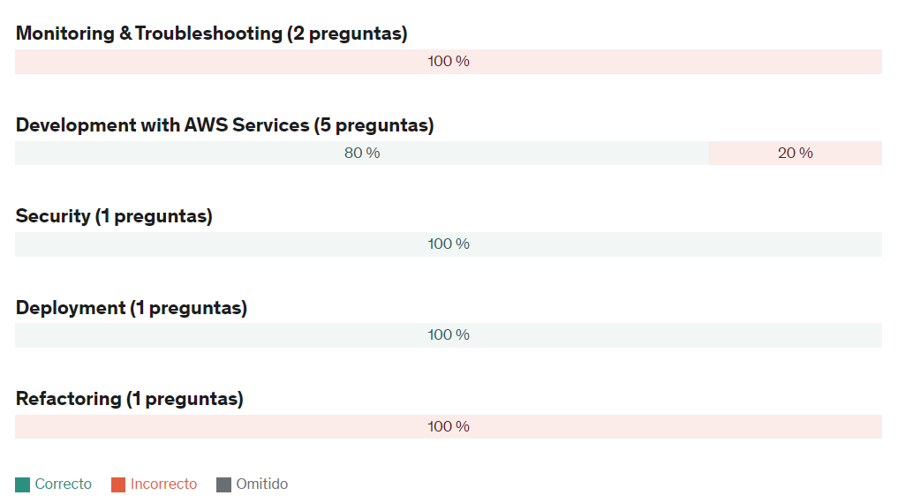

# Practice Test 7

- Score 60%

# ToDo list review:
- Security
- Refactoring
- Deployment
- Monitor and Troubleshooting
- Review Development with AWS services

## Review Security
- Highly classified documents are regularly stored in an Elastic Block Store. These technical documents contain specifications about electronic products. There is a legal agreement that this information should never be public. You need to explore the capabilities of AWS KMS to improve the security of the data to comply with the strict policy. Which of the following will provide the MOST secure solution?
    - Create a public key and a private key. USe the public key to encrypt the data and only use the private key for decryption
    - Use a combination of symmetric and asymmetric encryption. Encrypt the data with a symmetric key and use the asymmetric private key to decrypt the data
    - Generate a data key using a symmetric key. Then, encrypt data with the data key.
    - Use a symmetric key for encryption and decryption

https://docs.aws.amazon.com/kms/latest/developerguide/concepts.html#enveloping

https://docs.aws.amazon.com/kms/latest/developerguide/services-ebs.html

https://tutorialsdojo.com/aws-key-management-service-aws-kms/?src=udemy

## Review Refactoring
- A lead developer is looking for a way to decrease data retrieval latency from a MySQL database. The database is hosted on Amazon RDS. He wants to leverage AWS to implement a caching solution that supports Multi-AZ replication with sub-millisecond response times. What must the developer do that requires the LEAST amount of effort?
    - Set up an Elasticache for Memcached cluster between the application and database. Configure it to run with replication to achieve high availability 
    - Set up AWS Global Accelerator and integrate it with your application to improve overall performance
    - Set up an Elasticache for Redis between the application and database. Configure it to run with replication to achieve high availability.
    - Convert the database schema using the AWS Schema Conversion Tool and move the data to DynamoDB. Enable Amazon DynamoDB Accelerator (DAX)

https://aws.amazon.com/elasticache/redis-vs-memcached/

https://docs.aws.amazon.com/AmazonElastiCache/latest/mem-ug/SelectEngine.html

https://tutorialsdojo.com/amazon-elasticache/

## Review Deployment
- A serverless application consists of multiple Lambda Functions and a DynamoDB table. The application must be deployed by calling the CloudFormation APIs using AWS CLI. The CloudFormation template and the files containing the code for all the Lambda functions are located on a local computer. What should the Developer do to deploy the application?
    - Use the aws cloudformation package command and deploy using aws cloudformation deploy.
    - Use the aws cloudformation validate-template command and deploy using aws cloudformation deploy
    - Use the aws cloudformation deploy command
    - Use the aws cloudformation update-stack command and deploy using aws cloudformation deploy

https://docs.aws.amazon.com/cli/latest/reference/cloudformation/package.html

https://docs.aws.amazon.com/cli/latest/reference/cloudformation/deploy/index.html

https://tutorialsdojo.com/aws-cloudformation/

## Review Monitor and Troubleshooting
- A company has launched a new serverless application using AWS Lambda. The app ran smoothly for a few weeks **until it was featured on a popular website**. **As its popularity grew, so did the number of users receiving an error.** Upon viewing the Lambda function’s monitoring graph, the developer discovered a lot of throttled invocation requests. What can the developer do to troubleshoot this issue? (Select THREE.)
    - Configure reserved concurrency
    - Use exponential backoff in your app 
    - Use a dead-letter queue
    - Request a service quota increase
    - Use a compiled language like GoLang to improve the function's performance
    - Increase Lambda function timeout

https://aws.amazon.com/premiumsupport/knowledge-center/lambda-troubleshoot-throttling/

https://docs.aws.amazon.com/lambda/latest/dg/best-practices.html

https://tutorialsdojo.com/aws-lambda/

____________________

- A code that runs on a Lambda function performs a GetItem call from a DynamoDB table. The function runs three times every week. You noticed that the application kept receiving a ProvisionedThroughputExceededException error for 10 seconds most of the time. How should you handle this error?
    - Reduce the frequency of requests using error retries and exponential backoff.
    -  Enable DynamoDB Accelerator (DAX) to reduce response times from milliseconds to microseconds 
    - Refactor the code in the Lambda function to optimize its performance
    - Create a Local Secondary Index ( LSI ) to the existing DynamoDb table to increase the provisioned throughput 

https://docs.aws.amazon.com/amazondynamodb/latest/developerguide/Programming.Errors.html#Programming.Errors.RetryAndBackoff

https://docs.aws.amazon.com/general/latest/gr/api-retries.html

https://tutorialsdojo.com/amazon-dynamodb/

https://www.youtube.com/watch?v=3ZOyUNIeorU

## Review Development with AWS services
- A transcoding media service is being developed on Amazon Cloud. Photos uploaded to Amazon S3 will trigger a Lambda function. The Lambda function will cause the Step Functions to coordinate a series of processes that will do the image analysis tasks. The input of each function should be preserved on the result to conform to the application's logic flow. What should the developer do?
    - Declare an InputPath field filter on the Amazon State Language specification
    - Declare a ResultPath field filter on the Amazon States Language specification
    - Declare an OutputPath field filter on the Amazon State Language specification 
    - Declare a Parameters field filter on the Amazon State Language specification 

https://docs.aws.amazon.com/step-functions/latest/dg/concepts-input-output-filtering.html

https://docs.aws.amazon.com/step-functions/latest/dg/how-step-functions-works.html

https://tutorialsdojo.com/aws-step-functions/