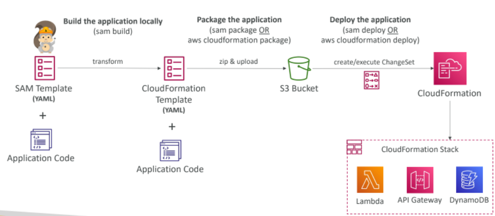
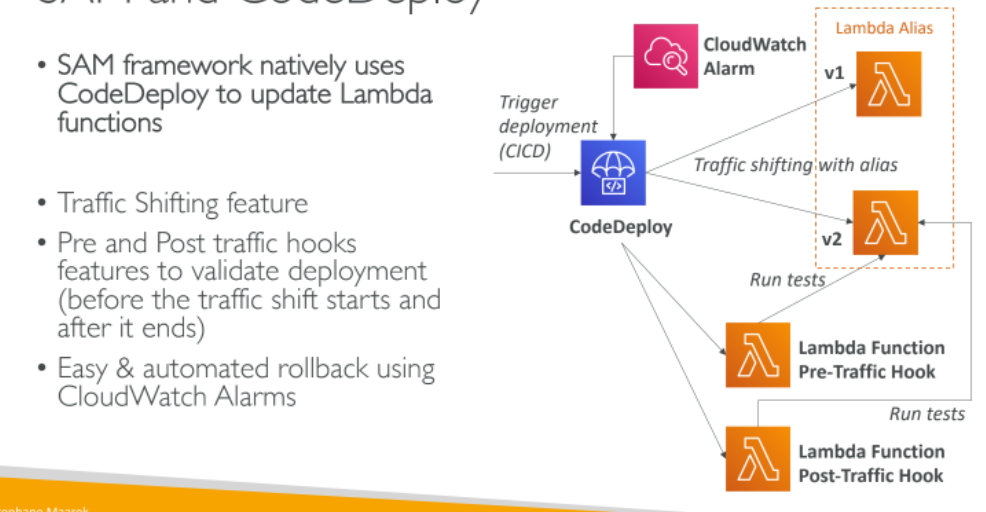
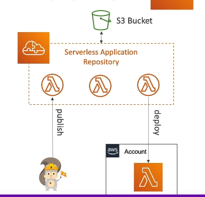

# SAM

- Serverless Application Model
- Its a framework
- Alternative for CF but specifically for serverless applications.
- Generate complex CloudFormation from simple SAM YAML file. You reference SAM template inside CF template using the Transform header.
- When you specify a transform, you can use AWS SAM syntax to declare resources in your template. The model defines the syntax that you can use and how it is processed.
- The AWS::Serverless transform, which is a macro hosted by AWS CloudFormation, takes an entire template written in the AWS Serverless Application Model (AWS SAM) syntax and transforms and expands it into a compliant AWS CloudFormation template. So, presence of "Transform" section indicates, the document is a SAM template.
- SAM can help you to run Lambda, API Gateway, DynamoDB locally
    - Provides a lambda-like execution environment locally
    - You need SAM cli and aws toolkits (IDE plugins which allows you to build, test, debug, deploy, and invoke Lambda functions built using AWS SAM)
- SAM supports the following resource types:
    - AWS::Serverless::Api
    - AWS::Serverless::Application: Embeds a serverless application from the AWS Serverless Application Repository or from an Amazon S3 bucket as a nested application. Nested applications are deployed as nested AWS::CloudFormation::Stack resources, which can contain multiple other resources including other AWS::Serverless::Application resources.
    - AWS::Serverless::Function
    - AWS::Serverless::HttpApi  
    - AWS::Serverless::LayerVersion
    - AWS::Serverless::SimpleTable
    - AWS::Serverless::StateMachine
- Commands to package and deploy
    - **sam init** - Initializes a serverless application with an AWS SAM template. The template provides a folder structure for your Lambda functions and is connected to an event source such as APIs, S3 buckets, or DynamoDB tables.
    - **sam build**: The sam build command builds any dependencies that your application has, and copies your application source code to folders under .aws-sam/build to be zipped and uploaded to Lambda.
    - **sam package**: package and upload to Amazon S3, generate CF template (or aws cloudformation package). This command creates a .zip file of your code and dependencies, and uploads the file to Amazon Simple Storage Service (Amazon S3). AWS SAM enables encryption for all files stored in Amazon S3. It then returns a copy of your AWS SAM template, replacing references to local artifacts with the Amazon S3 location where the command uploaded the artifacts.
    - **sam deploy**: deploy to CloudFormation (or aws cloudformation deploy). Performs the functionality of sam package. You can use the sam deploy command to directly package and deploy your application. sam deploy now implicitly performs the functionality of sam package. You can use the sam deploy command directly to package and deploy your application.
    - Actual commands needed are init, build and deploy.
- Sam deployment:

- Structure of a SAM project
    - /src (where lambda code is stored)
    - commands.sh: Additional commands for example to create additional resources (eg: a s3 bucket). Additionally you can also run package and deploy commands.
    - template.yaml
- In github there is a aws page called "awslabs" with examples of projects that use the SAM framework.
- Remember that CF has a designer to visualize all the stack of services created by a template.
- SAM Policy Templates: List of pre defined policies to attach to lambda functions inside the template. By doing so we avoid the need to create roles for our lambda functions and attach them to it (all underlying role creation is done by CF and SAM). Policies are added under the policies section inside a SAM template. Use for easy IAM policy definition.
- SAM is integrated with CodeDeploy to do deploy to Lambda aliases:

- Serverless Application Repository (SAR): 
    - Repository for Serverless applications
    - Built and published apps that can be re-used
    - The AWS Serverless Application Repository is a managed repository for serverless applications. It enables teams, organizations, and individual developers to store and share reusable applications, and easily assemble and deploy serverless architectures in powerful new ways. Using the Serverless Application Repository, you don't need to clone, build, package, or publish source code to AWS before deploying it. Instead, you can use pre-built applications from the Serverless Application Repository in your serverless architectures, helping you and your teams reduce duplicated work, ensure organizational best practices, and get to market faster. Integration with AWS Identity and Access Management (IAM) provides resource-level control of each application, enabling you to publicly share applications with everyone or privately share them with specific AWS accounts.
    
