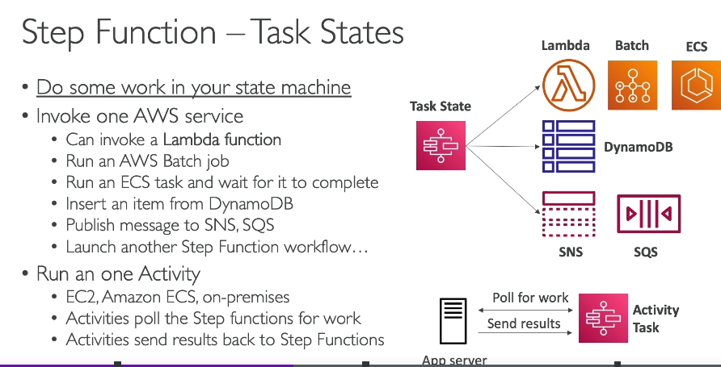
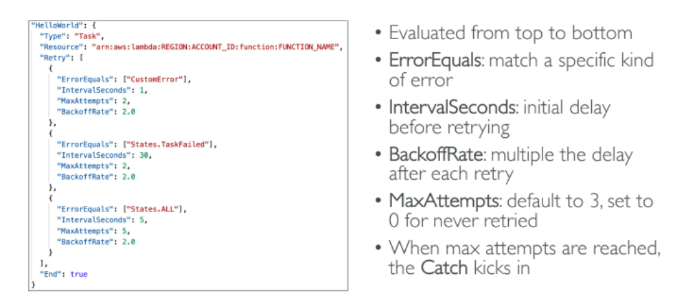
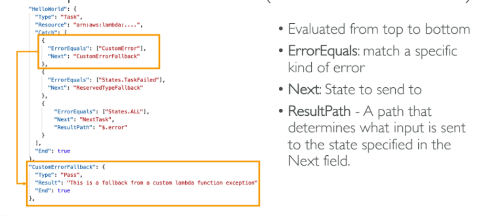

# Step Functions

- Model a workflow as a state machine
- One state machine per work flow
- Define a workflow in JSON (JSON can later be translated into a visual diagram)
- Step Functions are made up of tasks
- Step functions can run a AWS Service or other activities (such as a custom server polling the task for work and sending result back to task. Note that the activity is not invoked by the task but its actually polled by the server)

- Use Cases:
    - Function orchestration: You create a workflow that runs a group of Lambda functions (steps) in a specific order. One Lambda function's output passes to the next Lambda function's input. The last step in your workflow gives a result.
    - Branching lambdas based con a choice.
    - Error handling: If lambda fails perform a retry on it.
    - Human in the loop: Human approval before continuing execution
    - Parallel processing: A customer converts a video file into five different display resolutions, so viewers can watch the video on multiple devices all in parallel
    - Dynamic parallelism: A customer orders three items, and you need to prepare each item for delivery. You check each item's availability, gather each item, and then package each item for delivery. Using a Map state, Step Functions has Lambda process each of your customer's items in parallel. Once all of your customer's items are packaged for delivery, Step Functions goes to the next step in your workflow, which is to send your customer a confirmation email with tracking information.
    
    - Data processing: Depending upon your data processing needs, Step Functions directly integrates with other data processing services provided by AWS such as AWS Batch for batch processing, Amazon EMR for big data processing, AWS Glue for data preparation, Athena for data analysis, and AWS Lambda for compute. 
    - Machine Learning: The AWS Step Functions Data Science Software Development Kit (SDK) is an open-source library that allows you to easily create workflows that preprocess data, train and then publish your models using Amazon SageMaker and Step Functions. Step Functions lets you to orchestrate end-to-end machine learning workflows on SageMaker. These workflows can include data preprocessing, post-processing, feature engineering, data validation, and model evaluation. Once the model has been deployed to production, you can refine and test new approaches to continually improve business outcomes. You can create production-ready workflows directly in Python, or you can use the Step Functions Data Science SDK to copy that workflow, experiment with new options, and place the refined workflow in production.
    - Microservice orchestration: For long-running workflows you can use Standard Workflows with the AWS Fargate integration to orchestrate applications running in containers. For short-duration, high-volume workflows that require an immediate response, Synchronous Express Workflows are ideal. These can be used for web-based or mobile applications, which often have workflows of short duration, and require the completion of a series of steps before they return a response. You can directly trigger a Synchronous Express Workflows from Amazon API Gateway, and the connection is held open until the workflow completes or timeouts. For short duration workflows that do not require an immediate response, Step Functions provides Asynchronous Express Workflows.
    - IT and security automation
- Each task has an input and an output.
- Within a state machine, there can be only one state designated as the start state, which is designated by the value of the StartAt field in the top-level structure.
- Step Function States:
    - Task: Do some work in your state machine
    - Choice State: Test for condition to send to a branch.
    - Fail or Succeed State: Stop execution
    - Pass State: Simply pass its input to its output or inject some fixed data, without performing work.
    - Wait State: Provide a delay for a certain amount of time or until a specified time/date.
    - Parallel State:
        - Begin parallel branches of execution.
        - A Parallel state provides each branch with a copy of its own input data (subject to modification by the InputPath field). It generates output that is an array with one element for each branch, containing the output from that branch.
        - If any branch fails, because of an unhandled error or by transitioning to a Fail state, the entire Parallel state is considered to have failed and all its branches are stopped. If the error is not handled by the Parallel state itself, Step Functions stops the execution with an error.
        - **This type of state should only be used when you want to run processes asynchronously**. Parallel state executes each branch concurrently and independently. In the given scenario, the Lambda function processes data synchronously. This means that each output of a function is piped as an input to the next function. The Task State is much more applicable in this scenario.
    - Map State: 
        - Dynamically iterate steps. Run a set of steps for each element of an input array. 
        - While the Parallel state executes multiple branches of steps using the same input, a Map state will execute the same steps for multiple entries of an array in the state input.
        - The MaxConcurrencyfield’s value is an integer that provides an upper bound on how many invocations of the Iterator may run in parallel. 
    - Succeeded, Fail: Stop an execution with a failure or success
- Error handling: For Task and Parallel states
    - Two types of error handling. Handling the error is performed inside the state machine! (it should not be done on the services that interact with the task)
        - Retry: retry failed state. What happens and how many times to retry.
        - Catch: transition to failure path when all retries have passed.
    - We can retry/catch predefined error codes:
        - States.ALL: Any error name
        - States.Timeout: task ran longer than TimeoutSeconds or no heartbeat received
        - States.TaskFailed: execution failed.
        - States.Permissions: insufficient privileges to execute code
        - You can set your own errors and retry/catch them in the step functions
    - Retries example:
        
    - Retries fields:
        - ErrorEquals: A non-empty array of strings that match error names. When a state reports an error, Step Functions scans through the retriers. When the error name appears in this array, it implements the retry policy described in this retrier.
        - IntervalSeconds: An integer that represents the number of seconds before the first retry attempt (1 by default).
        - MaxAttempts: A positive integer that represents the maximum number of retry attempts (3 by default). If the error recurs more times than specified, retries cease and normal error handling resumes. A value of 0 specifies that the error or errors are never retried.
        - BackoffRate: The multiplier by which the retry interval increases during each attempt (2.0 by default)
    - Catch examples: When max attempts of retry are reached then catch blocks kick in.
        
        - Result error: You append to the input state the error message so that next task in the step function can access error message. If you don't specify a ResultPath, the default behavior is as if you had specified "ResultPath": "$". Because this tells the state to replace the entire input with the result, the state input is completely replaced by the result coming from the task result.Ej:
            - Input to task:
            ```json
            {"foo":"bar"}
            ```
            - Output with error:
             ```json
             {
                "foo":"bar",
                "error": {
                    "Error": "Error here"
                }
             }
             ```
        - Cache fields:
            - ErrorEquals: A non-empty array of strings that match error names, specified exactly as they are with the retrier field of the same name.
            - Next: A string that must exactly match one of the state machine's state names.
            - ResultPath: A path that determines what input is sent to the state specified in the Next field.
- State machine data takes the following forms:
    - The initial input into a state machine
        - Initial data is passed to the state machine's StartAt state. If no input is provided, the default is an empty object ({}).
    - Data passed between states
        - Each state's input consists of JSON text from the preceding state or, for the StartAt state, the input into the execution. 
    - The output from a state machine
        - The output of the execution is returned by the last state (terminal). This output appears as JSON text in the execution's result.
- Input and output processing: A Step Functions execution receives a JSON text as input and passes that input to the first state in the workflow. Individual states receive JSON as input and usually pass JSON as output to the next state. Understanding how this information flows from state to state, and learning how to filter and manipulate this data, is key to effectively designing and implementing workflows in AWS Step Functions. Each can use paths to select portions of the JSON from the input or the result. A path is a string, beginning with $, that identifies nodes within JSON text. Step Functions paths use JsonPath syntax. Ej:
```json
{
    "foo": 123,
    "bar": ["a", "b", "c"],
    "car": {
        "cdr": true
    }
}

$.foo => 123
$.bar => ["a", "b", "c"]
$.car.cdr => true
```
- 
    - InputPath: Select a portion of the state input.
    - Parameters: **Create a collection of key-value pairs** that are passed as input. The values of each can either be **static values** that you include in your state machine definition, or **selected from either the input or the context object with a path**. (like mapping values from input to another object defined by you, that might also contain static values). For key-value pairs where the value is selected using a path, the key name must end in .$.
    - ResultSelector: manipulate a state's result before ResultPath is applied. The ResultSelector field lets you create a collection of key value pairs, where the values are static or selected from the state's result. The output of ResultSelector replaces the state's result and is passed to ResultPath.
    - ResultPath: The output of a state can be a **copy of its input**, **the result** it produces (for example, the output from a Task state’s Lambda function), **or a combination of its input and result**. Use ResultPath to control which combination of these is passed to the state output. ResultPath field filter is the **only one that can control input values and its previous results** to be passed to the state output. 
    - OutputPath: OutputPath enables you to select a portion of the state output to pass to the next state. This enables you to filter out unwanted information, and pass only the portion of JSON that you care about. **If you don't specify an OutputPath the default value is $. This passes the entire JSON node (determined by the state input, the task result, and ResultPath) to the next state.**


- Context object:   
    - The context object is an internal JSON structure that is available during an execution, and contains information about your state machine and execution. This allows your workflows access to information about their specific execution. You can access the context object from the following fields:
        - InputPath
        - OutputPath
        - ItemsPath (in Map states)
        - Variable (in Choice states)
        - ResultSelector
        - Variable to variable comparison operators

- Standard vs Express workflows


-  In AWS Step Functions, you define your workflows in the **Amazon States Language**. The Step Functions console provides a graphical representation of that state machine to help visualize your application logic.