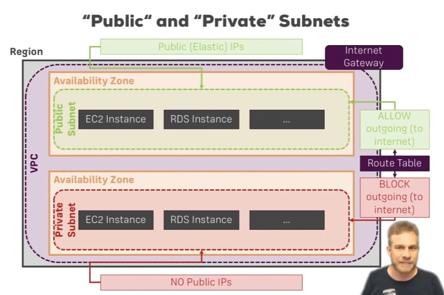
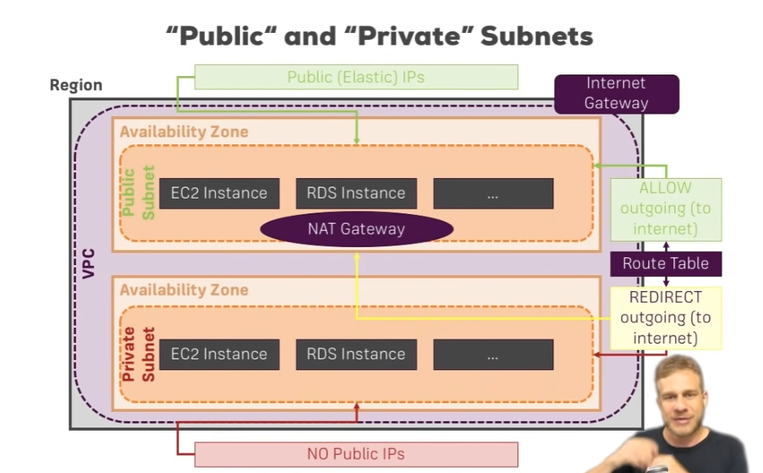
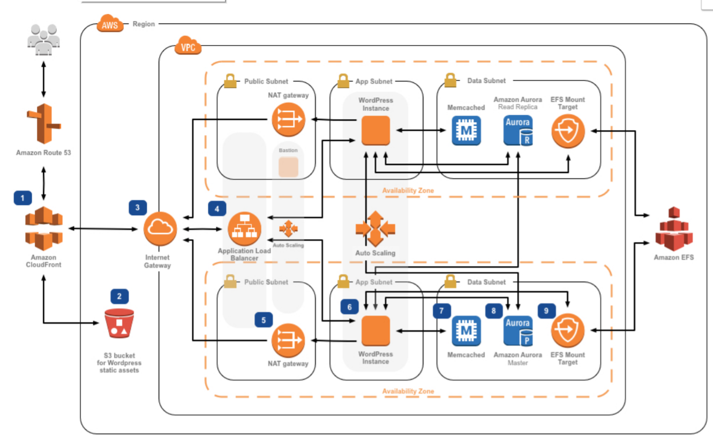

# VPC

- VPS span ALL AZs in a specific Region (estan por sobre todas las AZs de una region).
- Subnets are just in ONE AZ.
- Each subnet takes a range of IPs from the range of IPs defined for your whole VPC.
- The default VPS already comes with an Internat Gateway so that resources inside VPC can access the internet.
- SGs are scoped to a particular VPC.
- NACLS act at a subnet level. Defines what traffic can access a particular subnet.
- You can also route traffic inside VPC by using route tables. Route tables control routing of outgoing Network requests.
- **Default route table limit per VPC is 200.**
- A VPC comes with a default route table. You can modify/edit this main route table.
- By making a subnet public, it means that resources in it may receive a public IP. If you make it private then you limit the ability of a resource in that subnet to get a public IP.

- Note: How can instances inside a private subnet access the internet? You can modify routing tables so that all outgoing traffic from the subnet ir redirected to a NAT gateway. NAT will have public IP and will make requests on their behalf. NAT lives in the public subnet.

- VPC is a private network to deploy your resources (its regional, meaning that if you have your resources in two regions you need two VPCs).
- You partition a VPC with subnets (defined at the AC level). Each subnet has a range of IPs. Use SGs and NACLS to secure resources inside each subnet.
- When you create a VPC, you must specify a range of IPv4 addresses for the VPC in the form of CIDR blocks. When you create a subnet, you specify CIDR blocks of subnet which is a subset of the VPC CIDR block.
- Types of subnets: Private, Public and VPN-only-subnets (when a subnet is connected to the outside through a VPN gateway).
- A subnet must be associated with one route table at a time. But the same route table can be used by many subnets.
- Use Route tables to route traffic through subnets. A route table contains a set of rules called routes, that determine where network traffic from your VPC is routed. You associate a subnet with a route table. Each route table specifies a range of IP addresses where you want the traffic to go (the destination) and the gateway, network interface or connection through which to send the traffic. Every route table contains a local route for communication within VPC. This route is added by default top all route tables.
- You can associate a route table with an internet gateway or a virtual private gateway. Then a route table is associated with a gateway, its referred as a gateway route table. You can create a gateway route table for fine-grain control over the routing path of traffic that enters your VPC through an internet gateway by redirecting that traffic to a middlebox appliance in your VPC.
- Internet Gateway: Instances within a public subnet can access internet through them (the default VPC comes with one already). They have two purposes: Provide a target in your VPC route tables for internet-routable traffic and perform network address translation (NAT) for instances that have been assigned a public IPv4 address.
- NAT: NAT Gateway (managed service) or NAT Instances (EC2s to run custom NATs). You can route traffic through NAT. Instances within private network go through Internet gateway to gain access to the internet while your instance is in a private network.
- If subnet is associated with a rote table that has route to IG, then its a public subnet. If not then its a private one.
- To provide instance with internet access without assigning a public IP you can use NAT device instead.
- NACL: Created at the subnet level. Use to allow or deny IPs. Its the first layer of security inside our subnets. The default VPC comes with a NACL that allows all in/out traffic flow. You might for example add NACL rules similar to the ones in SGs for extra layer of security. Each subnet must be associated with exactly one NACL. NACLs contain a numbered list of rules. The rules are evaluated in order starting with the lowest numbered rule. NACLs have separate inbound and outbound rules and each rule can either allow or deny traffic. NACLs are stateless which means that responses to allowed inbound traffic are subject to rules for outbound traffic (and vice versa). Its not like SGs that are stateful. A rule is composed of: rule number, type, protocol, prot range, source, destination, allow/deny.
- A Network Access Control List (ACL) is an optional layer of security for your VPC that acts as a **firewall for controlling traffic in and out of one or more subnets**. You might set up network ACLs with rules similar to your security groups in order to add an additional layer of security to your VPC. When you create a custom Network ACL and associate it with a subnet, **by default, this custom Network ACL denies all inbound and outbound traffic until you add rules**. A network ACL has **separate inbound and outbound rules, and each rule can either allow or deny traffic**. Network ACLs are **stateless**, which means that responses to allowed inbound traffic are subject to the rules for outbound traffic (and vice versa). The client that initiates the request chooses the ephemeral port range. The range varies depending on the client's operating system. List of ephemeral port ranges:
    - Many Linux kernels (including the Amazon Linux kernel) use ports 32768-61000.
    - Requests originating from Elastic Load Balancing use ports 1024-65535.
    - Windows operating systems through Windows Server 2003 use ports 1025-5000.
    - Windows Server 2008 and later versions use ports 49152-65535.
    - A NAT gateway uses ports 1024-65535.
    - AWS Lambda functions use ports 1024-65535. 
- Flow Logs: Info about traffic flow at VPC / Subnet / ENI levels.
    - Flow log data can be published to Amazon CloudWatch Logs or Amazon S3. After you've created a flow log, you can retrieve and view its data in the chosen destination.
    
- VPC Peering: Connectivity between VPCs. Connect as if they were in the same network. Transitivity is not allowed.
- VPC Endpoints: Connect resources that are not in the same VPC without the need to go out to the internet.
- Site to site VPC and Direct Connection: Use to connect on-premise with VPC (virtually or physically)
- Typical architectures
    -  Three Tier architecture
    
    - LAMP Stack:
        - Linux OS EC2 instances
        - Apache web server
        - PHP app logic
        - MySql running on RDB
        - Can add Cache or EBS drive for local storage of app data
    - WordPress:
    
- SGs vs NACLs:
    - SG
        - Operate at instance level
        - Supports allow rules only
        - Stateful: Return traffic is allowed regardless of any rules.
    - NACLs:
        - Operate at subnet level
        - Supports allow and deny rules
        - Stateless: Return traffic must be explicitly allowed by rules.

## Quiz
- You setup an internet gateway in your VPC, but your EC2 instances still don't have access to the internet. Which of the following is NOT a possible issue?
    - Route tables have missing entries
    - The SG does not allow network in -> SGs are stateful and if traffic can go out then it can go back in. Besides, SGs are only allow rules, not denies.
    - The NACL does not allow traffic out

# Notes from practice tests
- A **VPC endpoint** enables you to **privately connect your VPC to supported AWS services** and VPC endpoint services powered by AWS PrivateLink **without requiring an internet gateway, NAT device, VPN connection, or AWS Direct Connect connection**. Instances in your VPC do not require public IP addresses to communicate with resources in the service. **Traffic between your VPC and the other service does not leave the Amazon network**. **There are two types of VPC endpoints: interface endpoints and gateway endpoints**. 
    - **An interface endpoint** is an elastic network interface with a private IP address from the IP address range of your subnet that serves as an entry point for traffic destined to a supported service.
        - Send traffic to endpoint services that use a Network Load Balancer to distribute traffic. Traffic destined for the endpoint service is resolved using DNS.
        - By default, each interface endpoint can support a bandwidth of up to 10 Gbps per Availability Zone and automatically scales up to 40 Gbps.
        - The security group for the interface endpoint must allow communication between the endpoint network interface and the resources in your VPC that must communicate with the service. By default, the interface endpoint uses the default security group for the VPC. Alternatively, you can create a security group to control the traffic to the endpoint network interfaces from the resources in the VPC. To ensure that tools such as the AWS CLI can make requests over HTTPS from resources in the VPC to the AWS service, the security group must allow inbound HTTPS traffic.
        - 
    - **A gateway endpoint** is a gateway that you specify as a target for a route in your route table for traffic destined to a supported AWS service. send traffic to Amazon S3 or DynamoDB using private IP addresses. You route traffic from your VPC to the gateway endpoint using route tables. Gateway endpoints do not enable AWS PrivateLink. The following AWS services are supported:
        - Amazon S3
        - DynamoDB
        - You should note that S3 now supports both gateway endpoints as well as the interface endpoints.